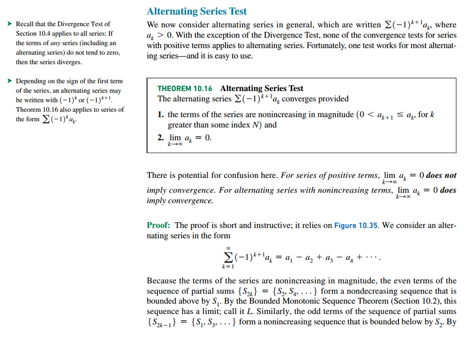
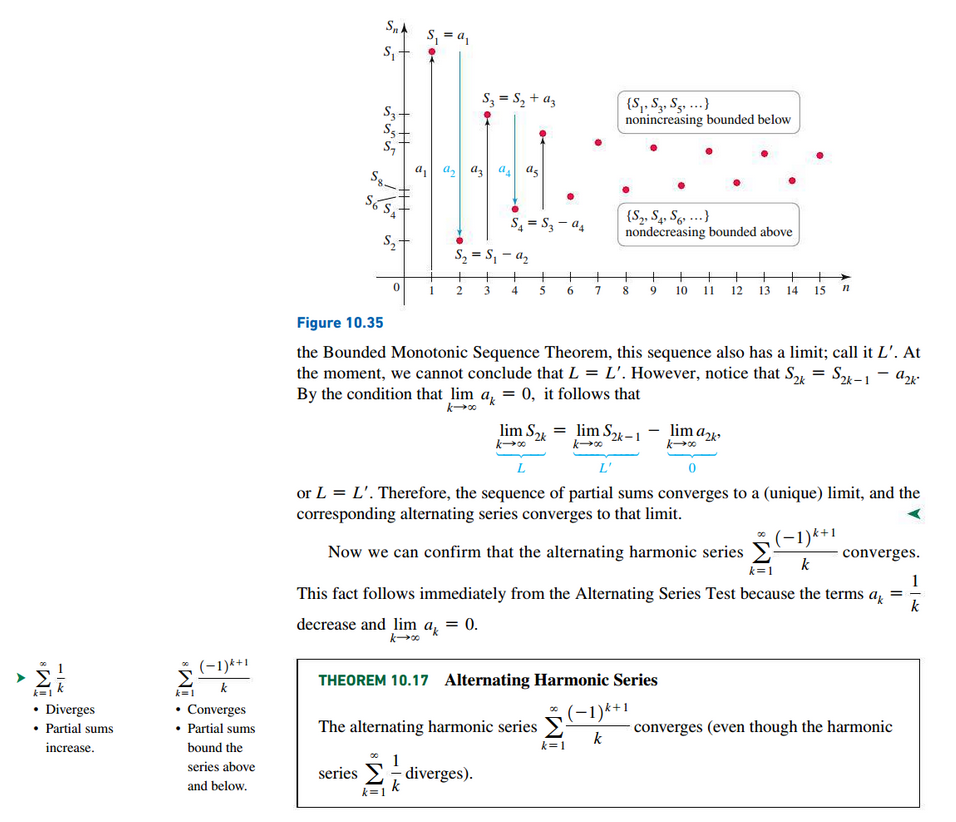
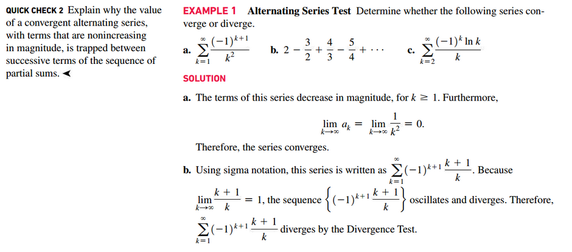
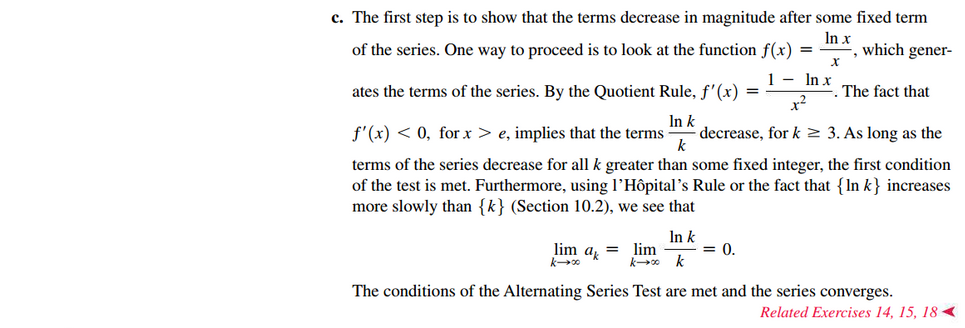
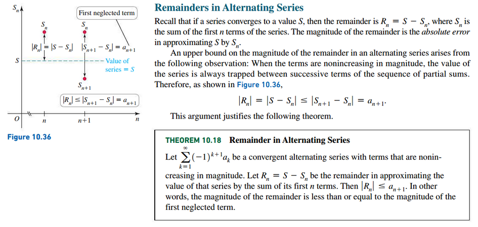
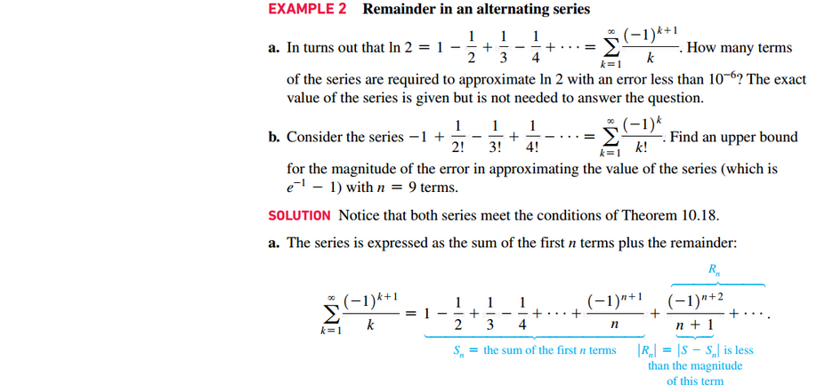
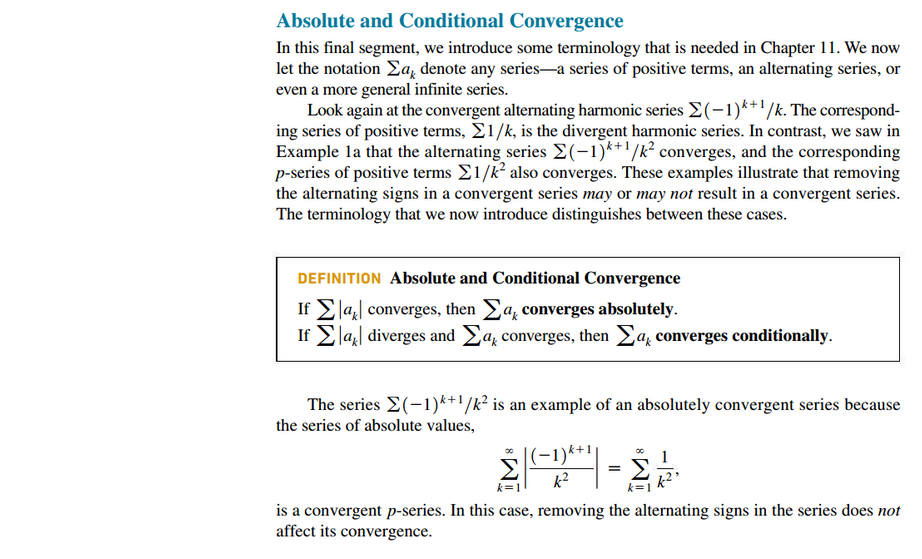
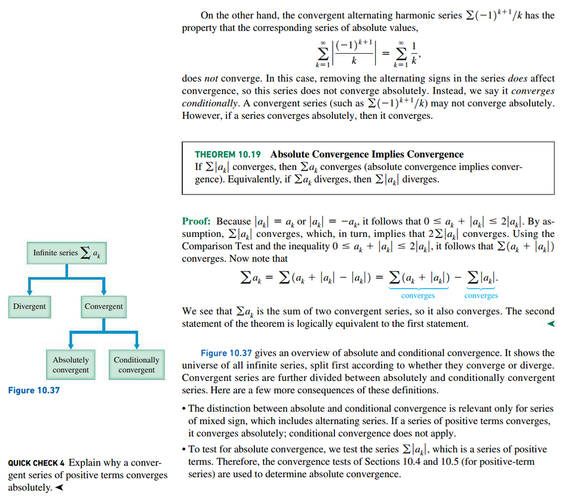
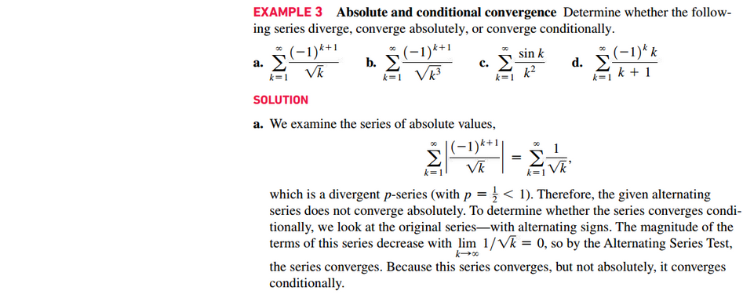
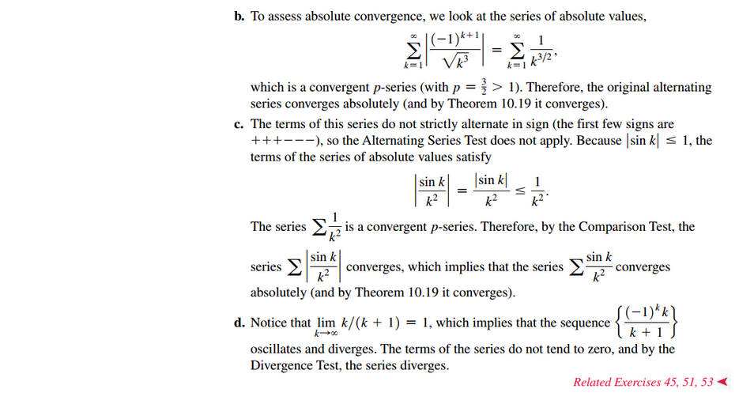

# Section 10.6: Alternating Series

## Alternating Harmonic Series

## Remainders in Alternating Series

## Absolute and Conditional Convergence

 

# Resources

Textbook

+ Calculus, Early Transcendentals 3rd Edition - Briggs, Cochran, and Gillet

