# Section 11.1: Approximating Functions with Polynomials

## What Is a Power Series?

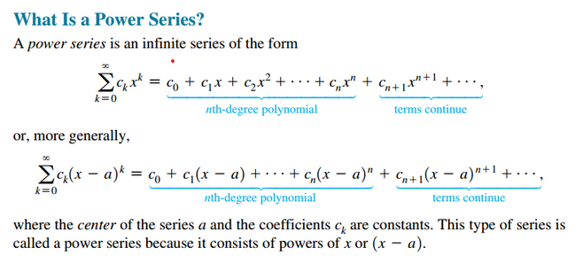
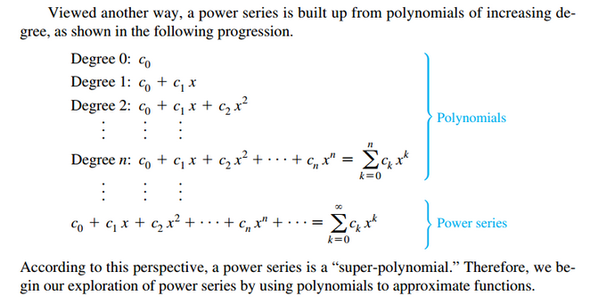

## Linear and Quadratic Approximation

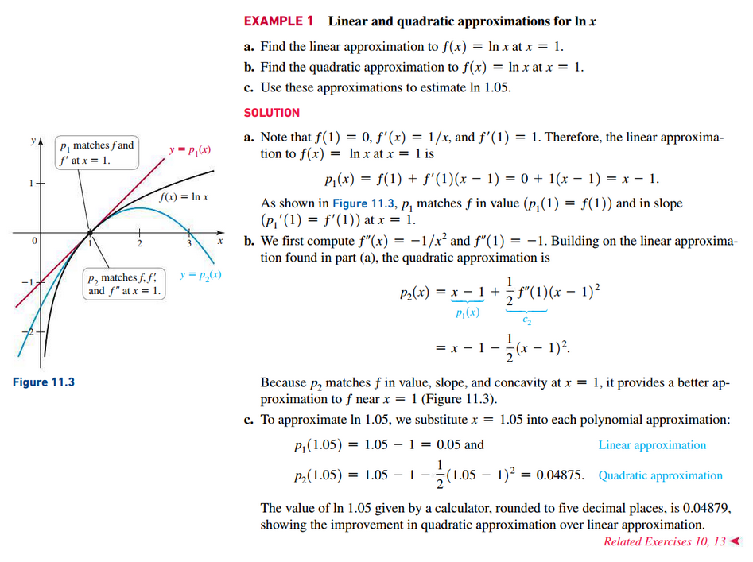

## Taylor Polynomials

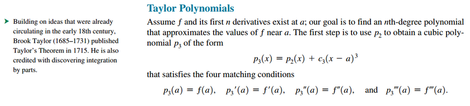
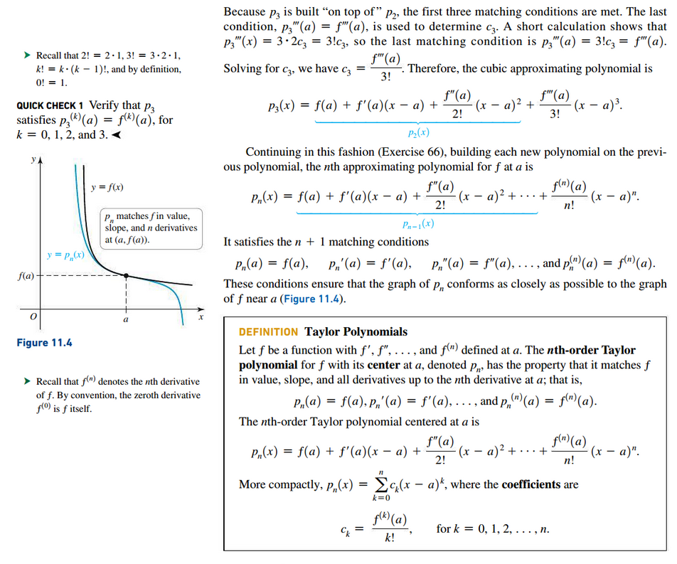

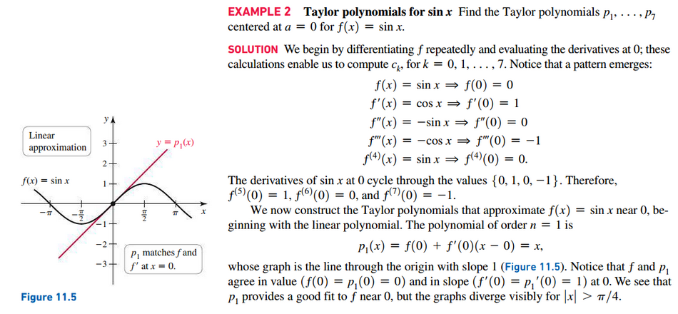
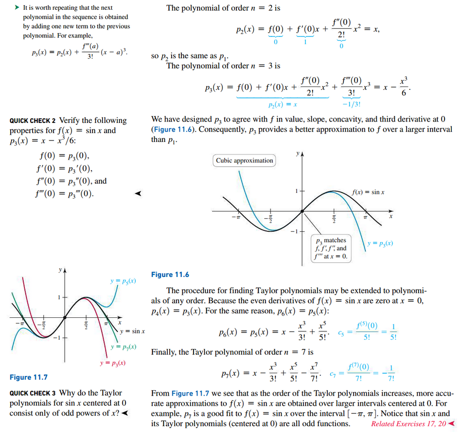

### Approximations with Taylor Polynomials

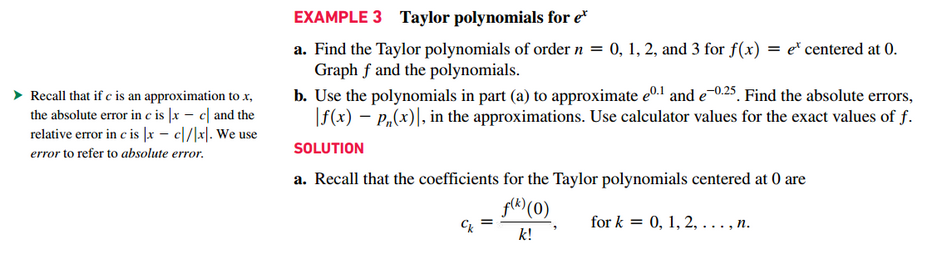
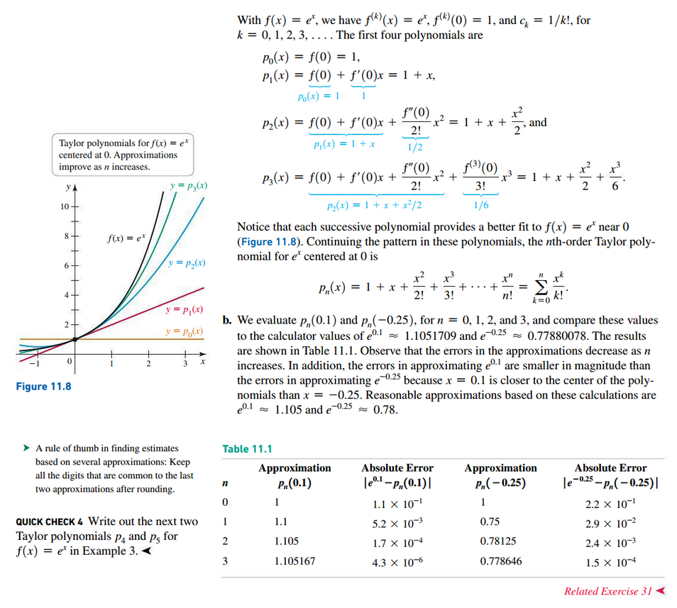

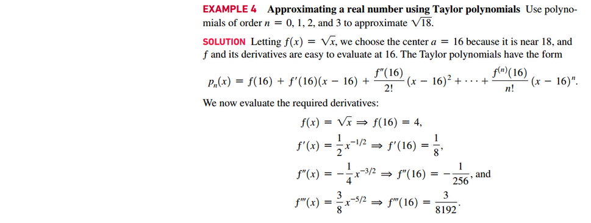
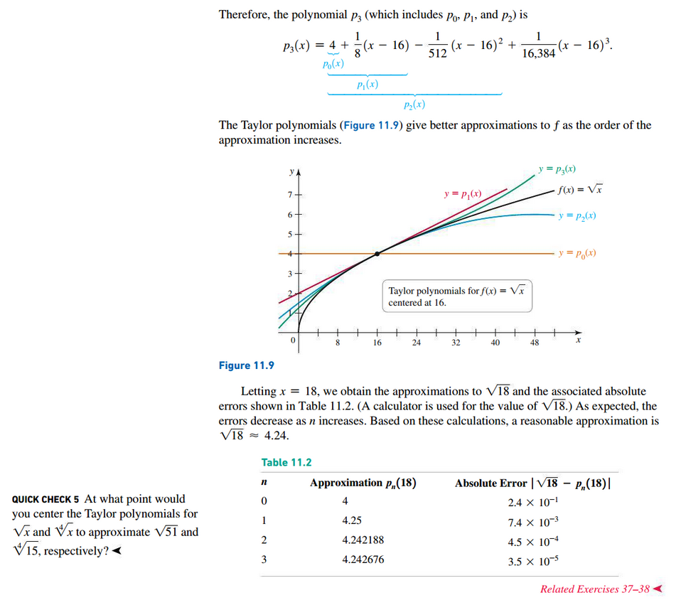

### Remainder in a Taylor Polynomial

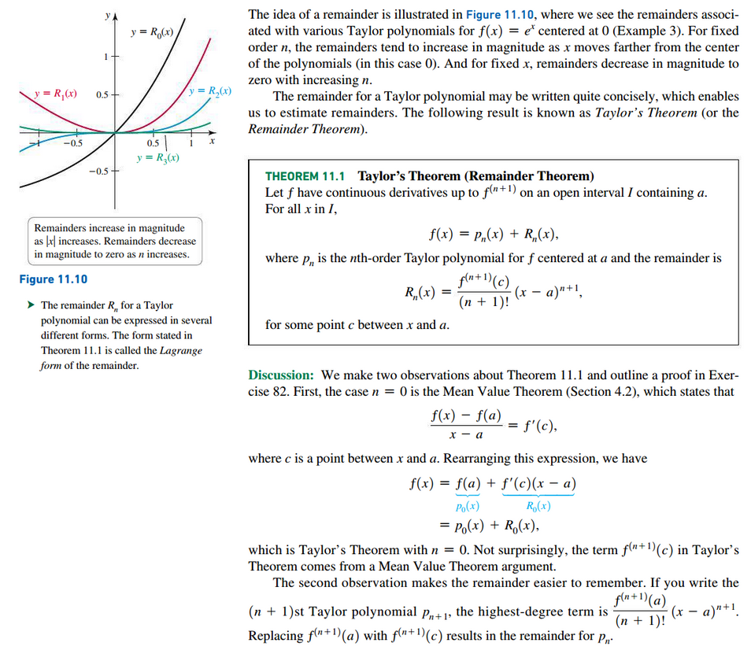

#### Estimating the Remainder

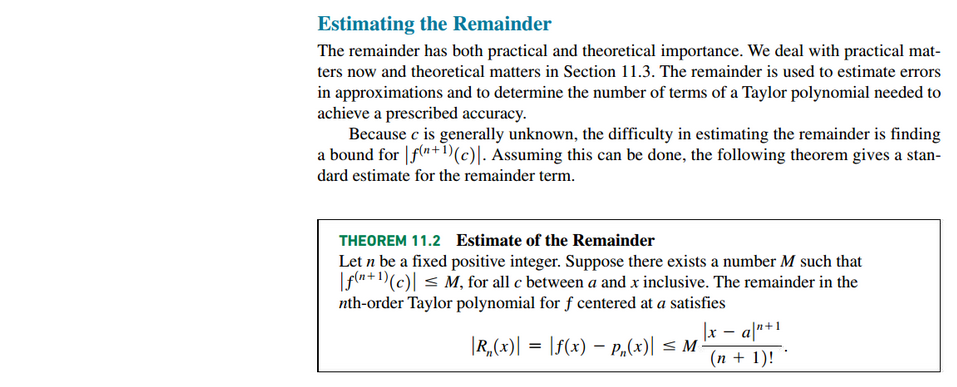
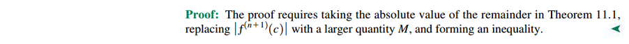

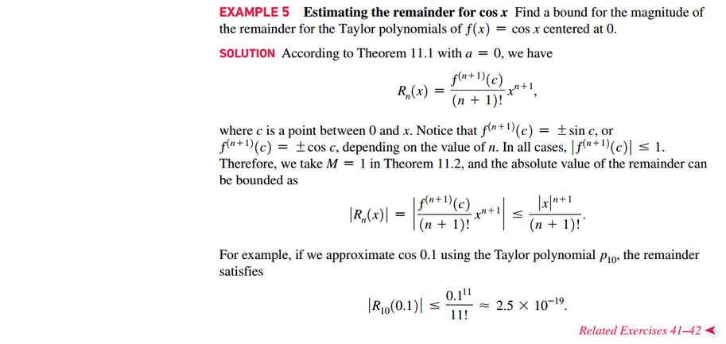

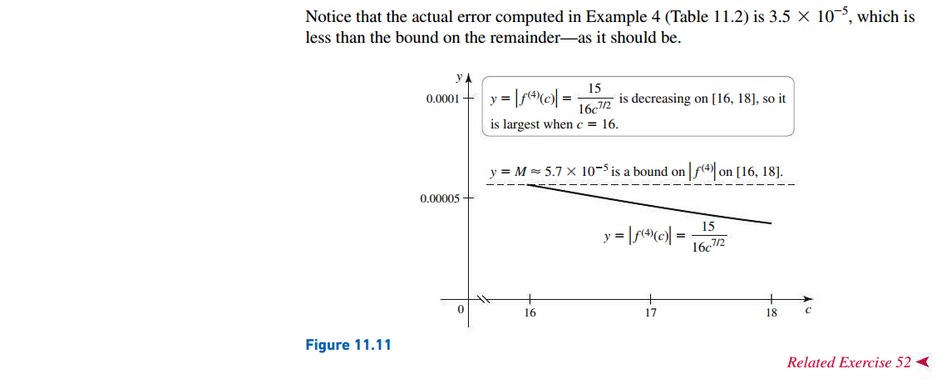

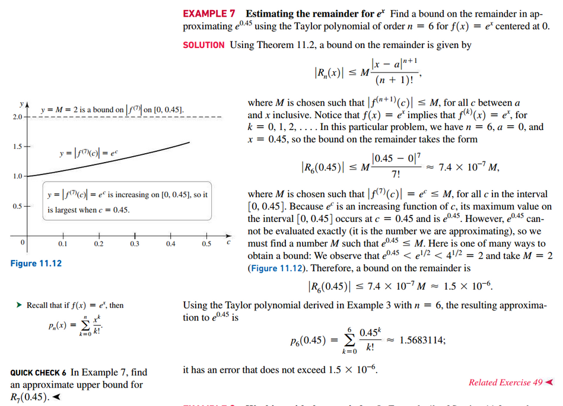

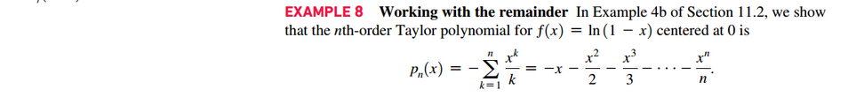
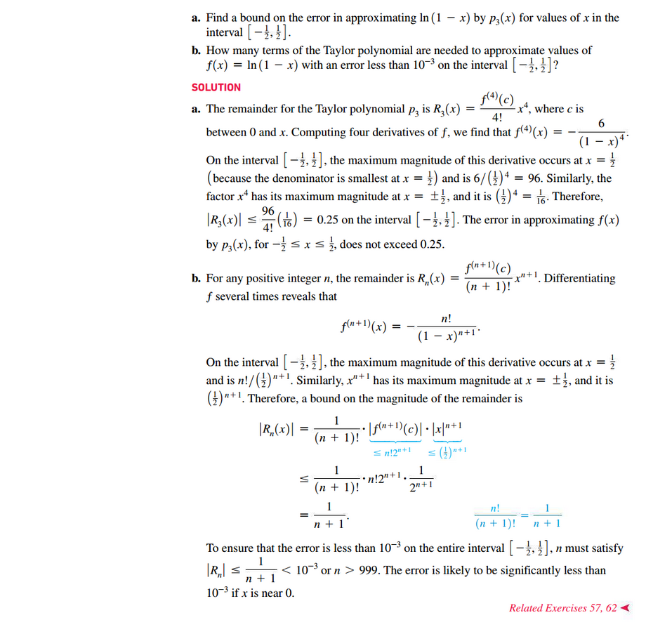

 

# Resources

Textbook

+ Calculus, Early Transcendentals 3rd Edition - Briggs, Cochran, and Gillet

