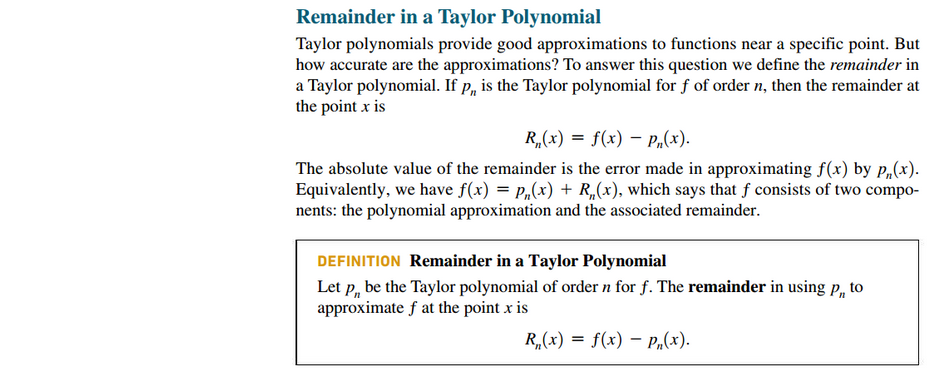
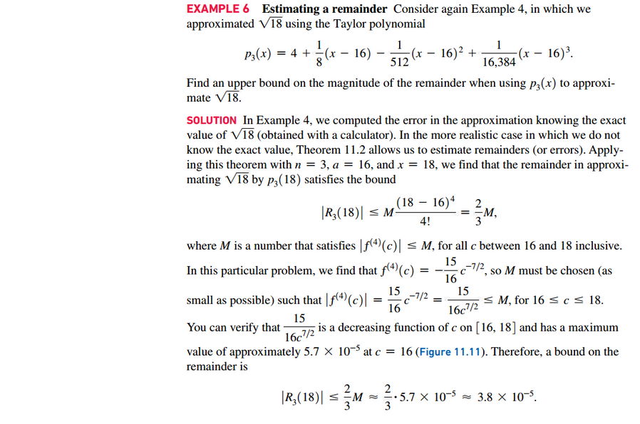

# Section 11.1: Approximating Functions with Polynomials

## What Is a Power Series?

## Linear and Quadratic Approximation

## Taylor Polynomials

### Approximations with Taylor Polynomials

### Remainder in a Taylor Polynomial

#### Estimating the Remainder

 

# Resources

Textbook

+ Calculus, Early Transcendentals 3rd Edition - Briggs, Cochran, and Gillet

