# Section 11.2: Properties of Power Series

## Convergence of Power Series

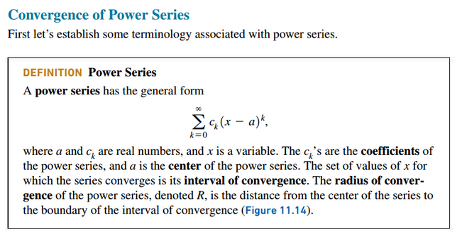
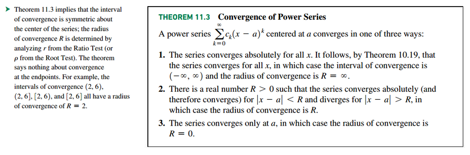

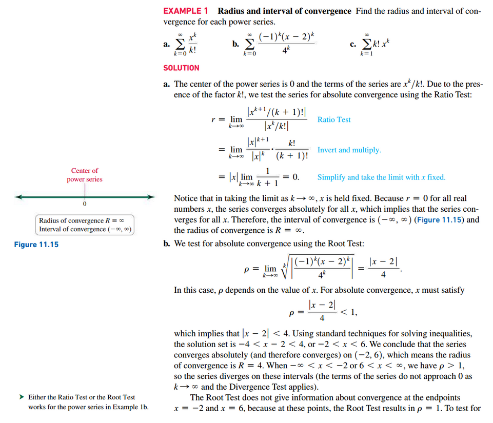
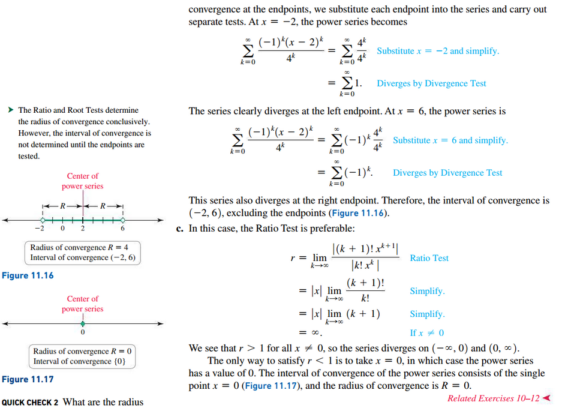

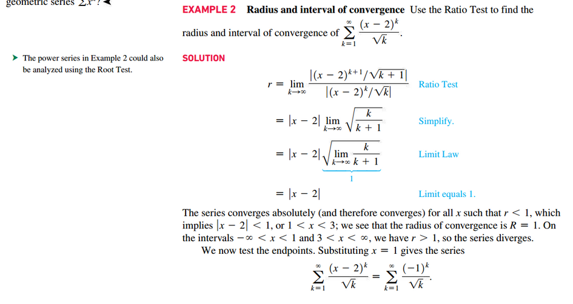
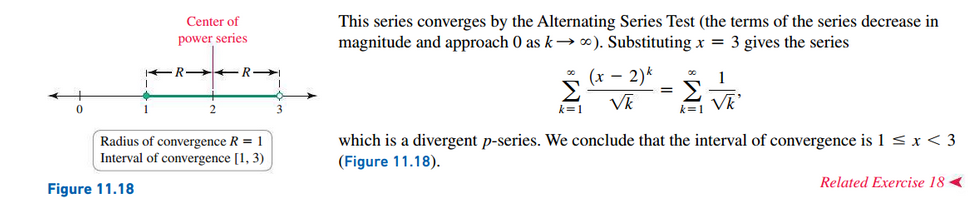

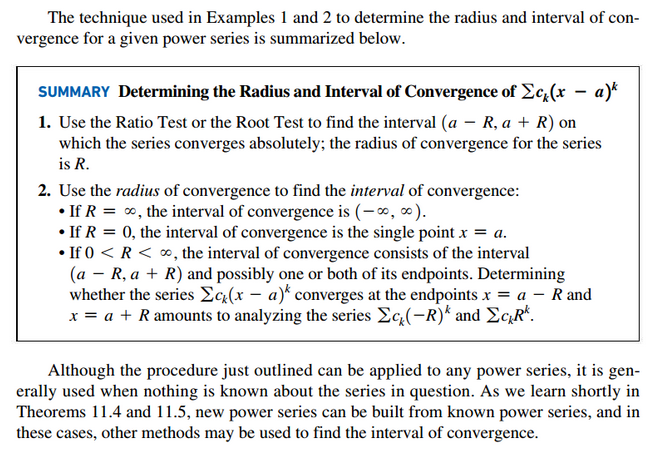

## Combining Power Series

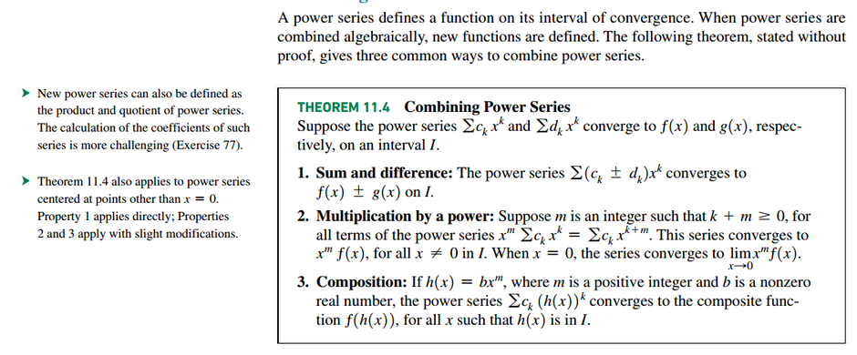

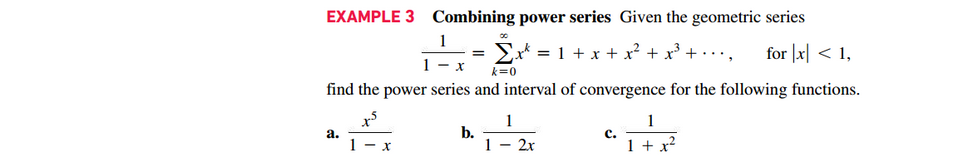
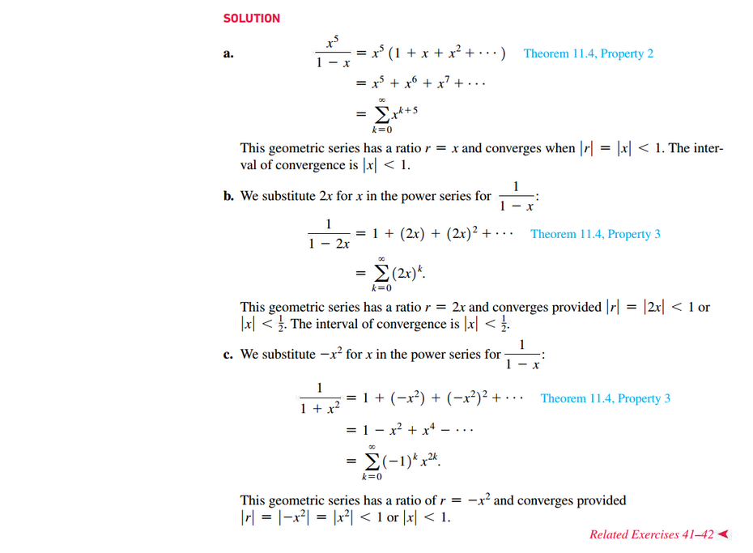

## Differentiating and Integrating Power Series

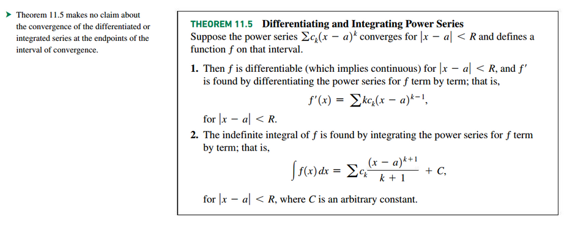

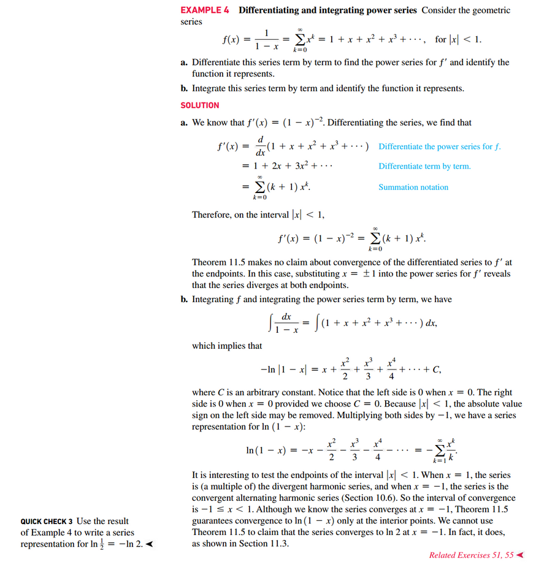
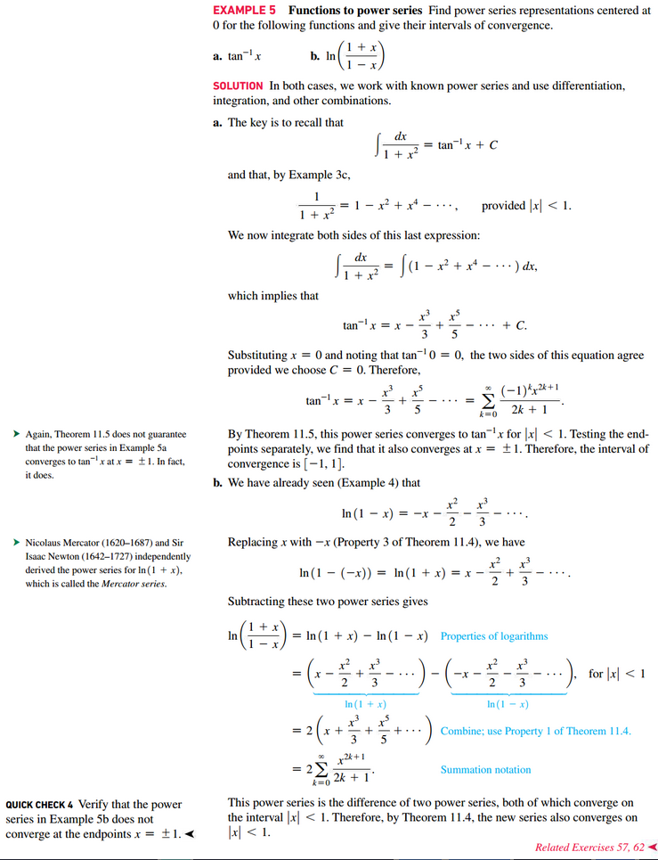

 

# Resources

Textbook

+ Calculus, Early Transcendentals 3rd Edition - Briggs, Cochran, and Gillet

