# Section 11.3: Taylor Series

## Taylor Series for a Function

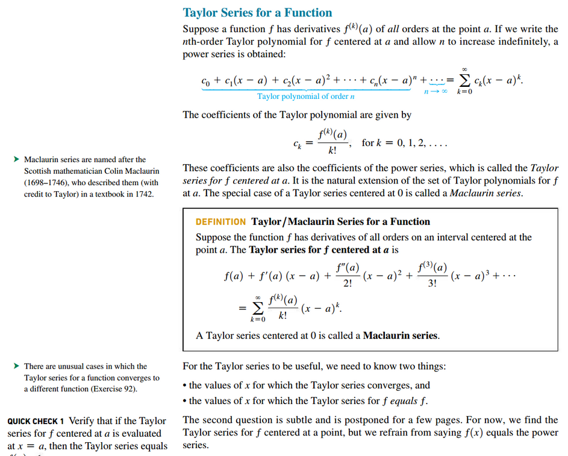

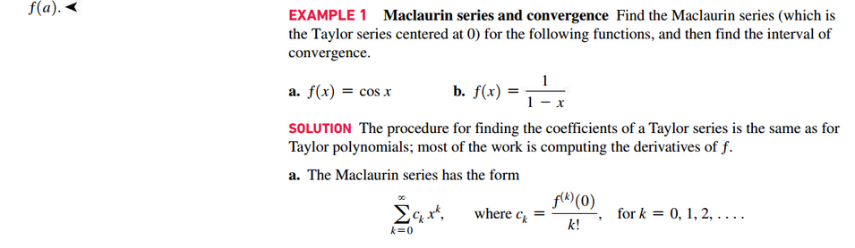
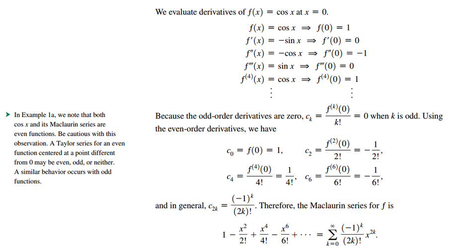
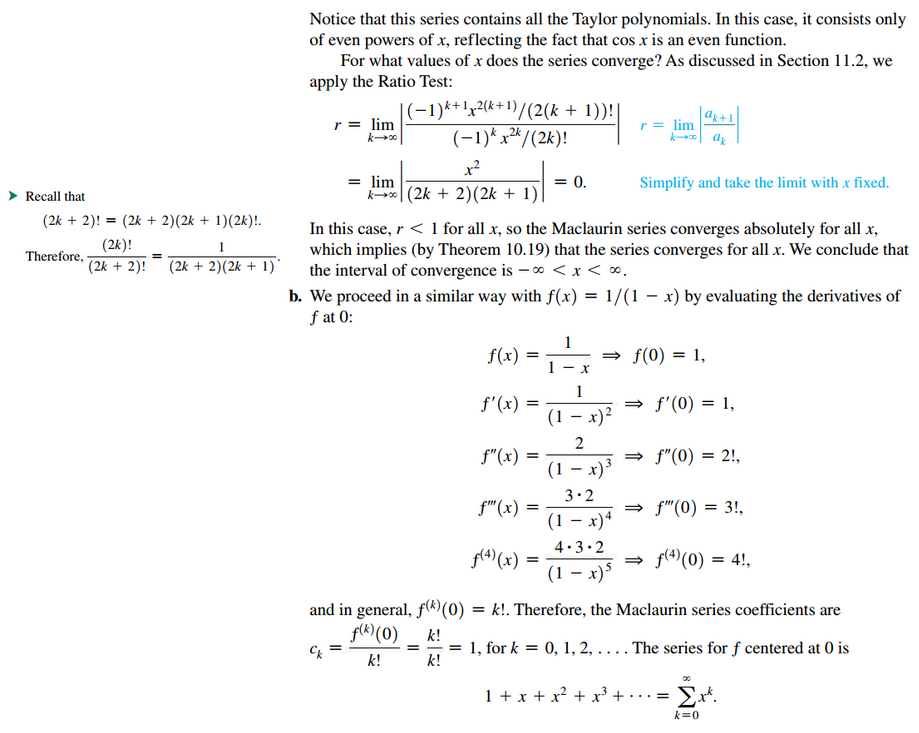
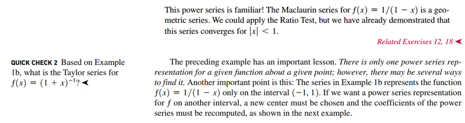

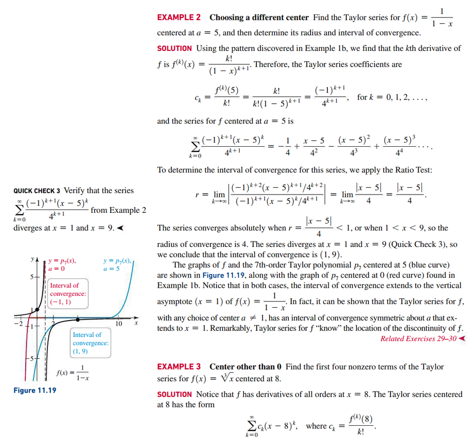
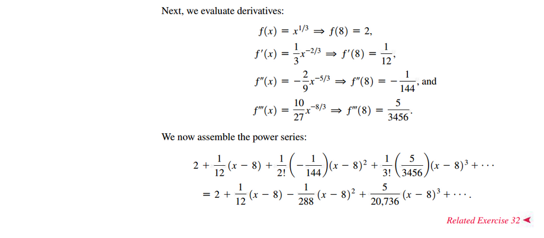

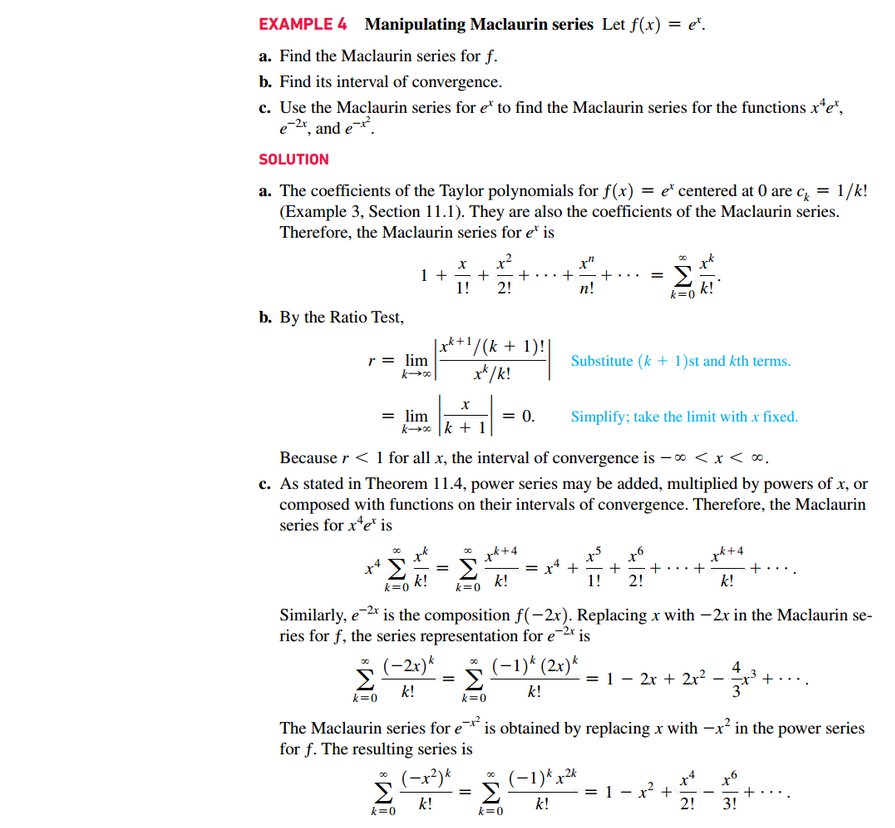
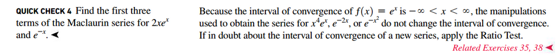

## The Binomial Series

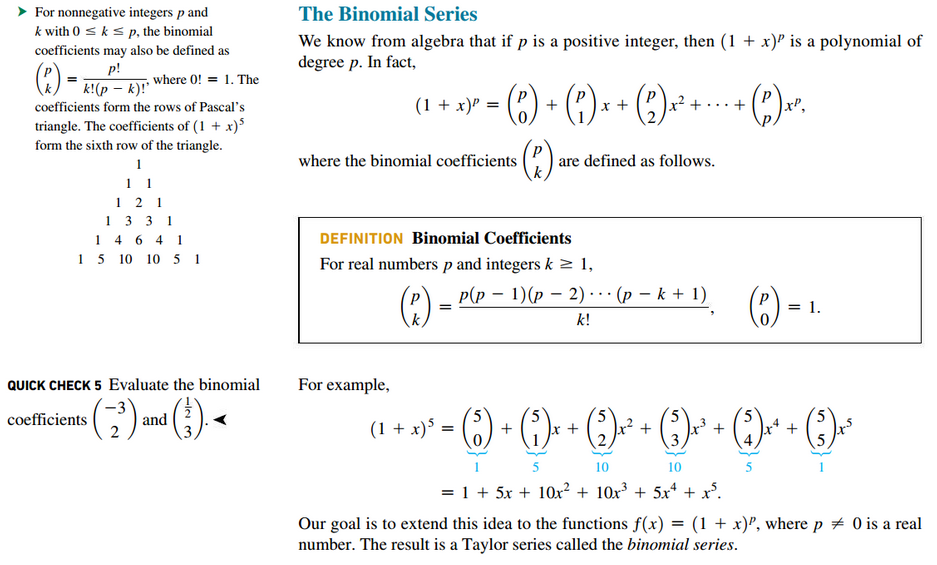

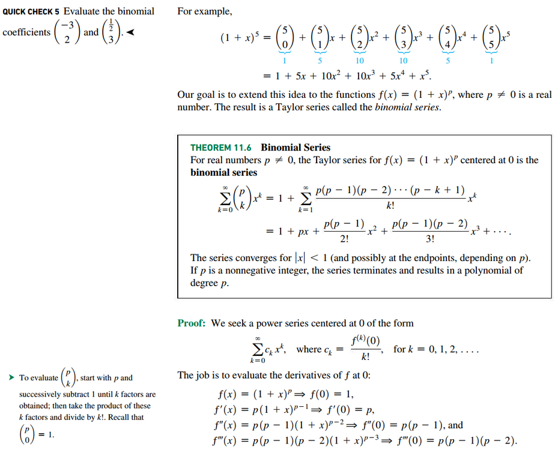
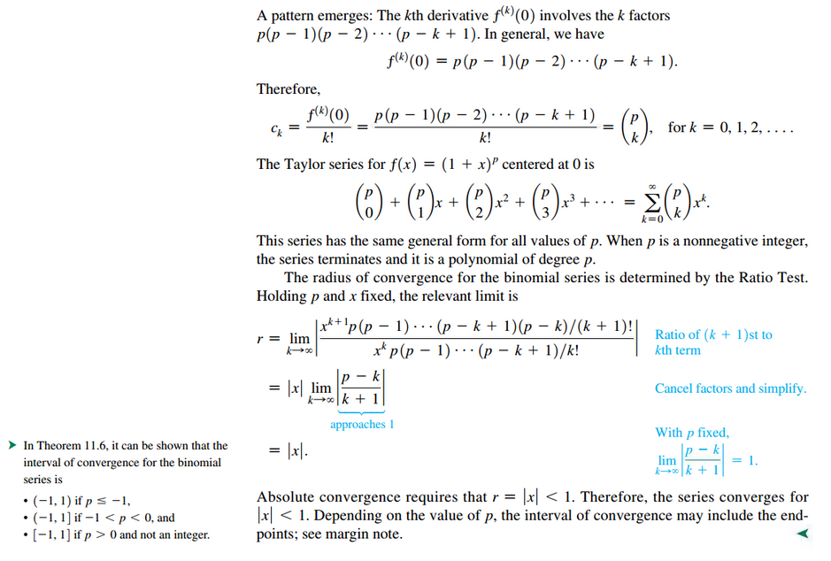

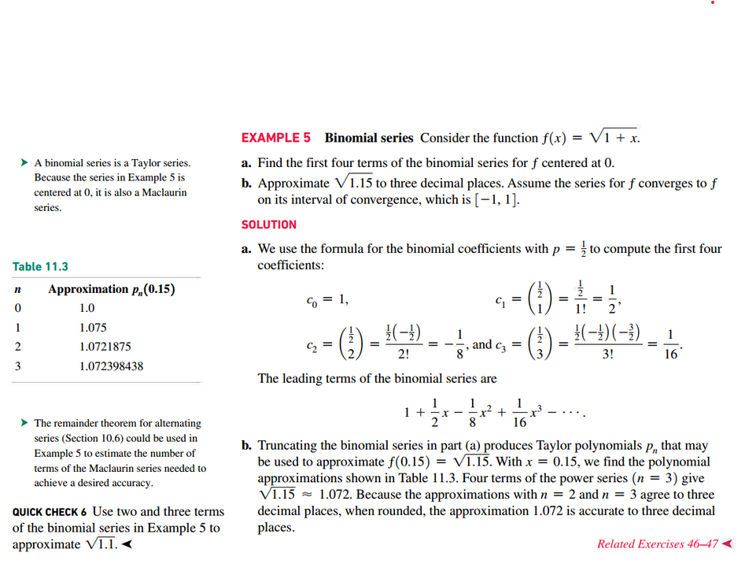
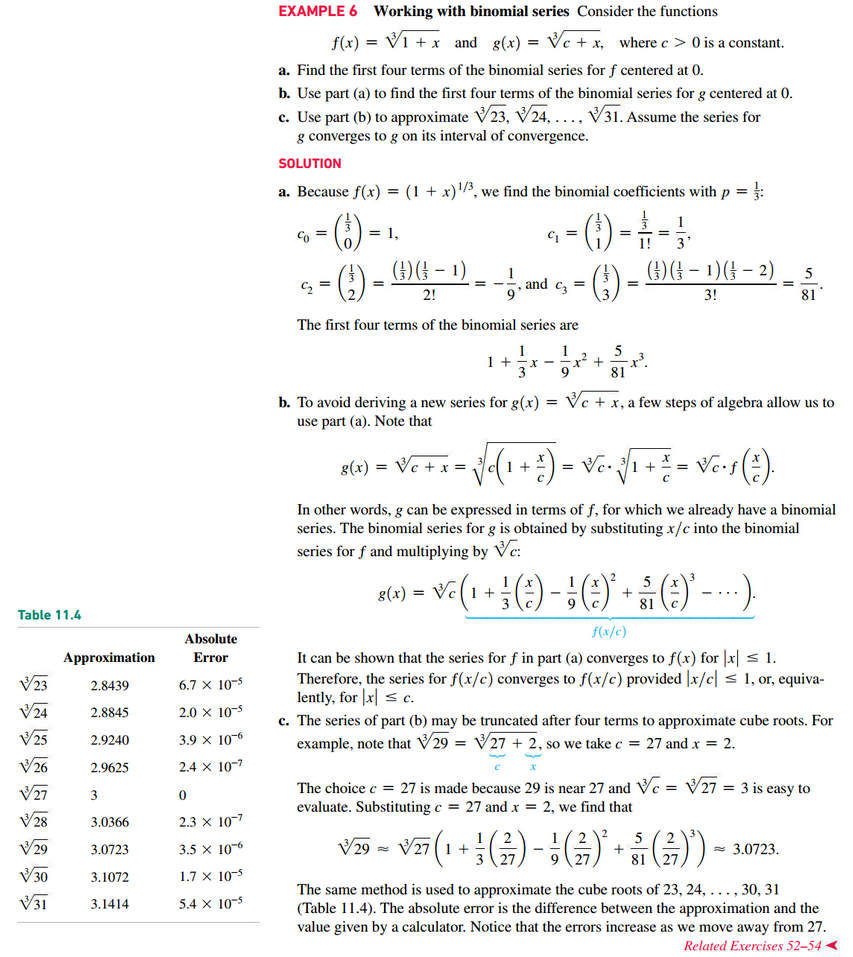

## Convergence of Taylor Series

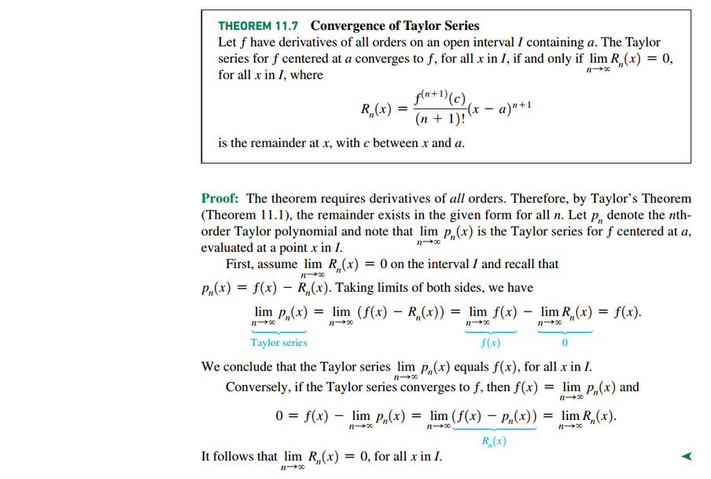

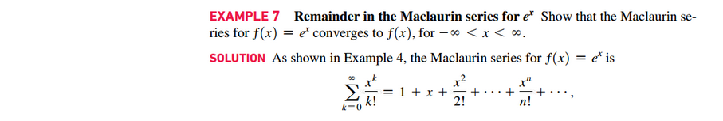
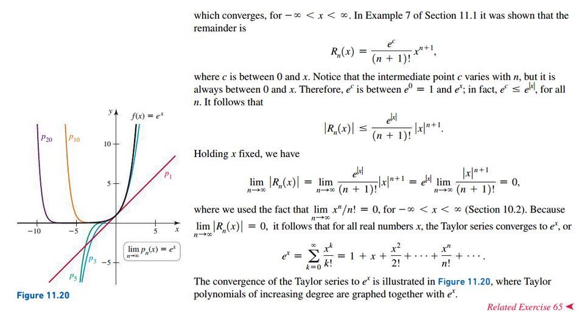

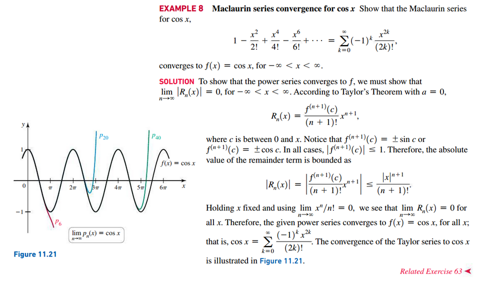

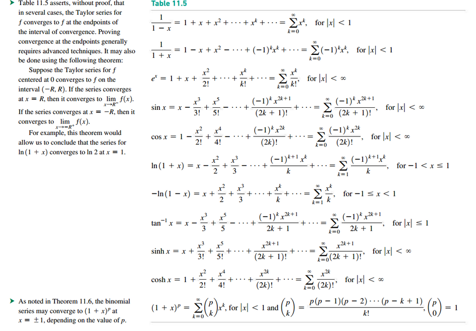

 

# Resources

Textbook

+ Calculus, Early Transcendentals 3rd Edition - Briggs, Cochran, and Gillet

