# Section 11.4: Working with Taylor Series

## Limits by Taylor Series

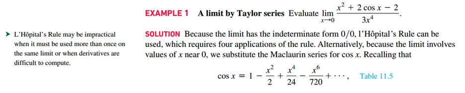
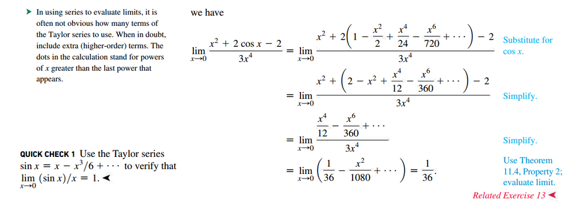

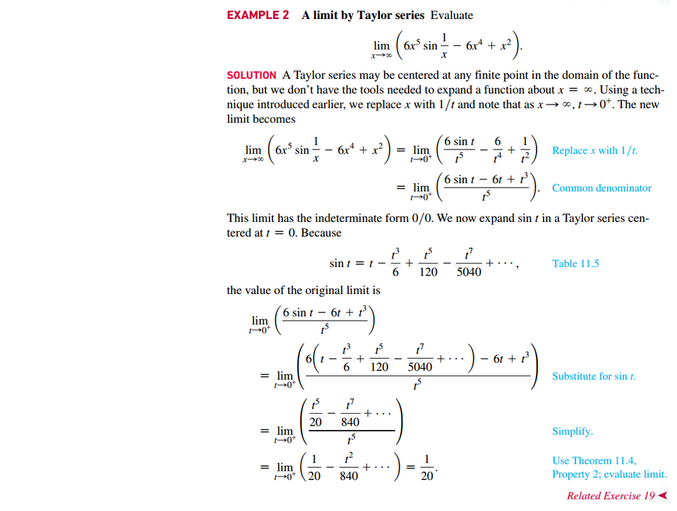

## Differentiating Power Series

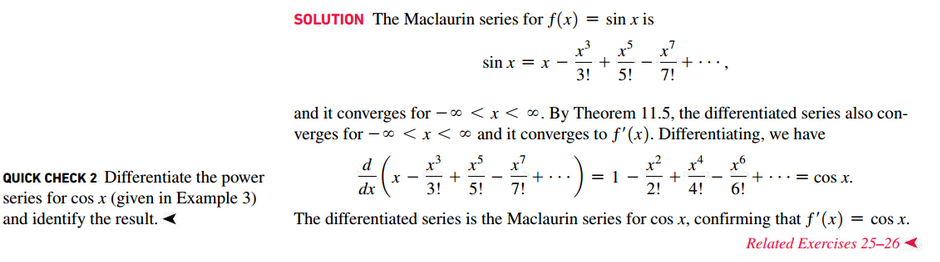

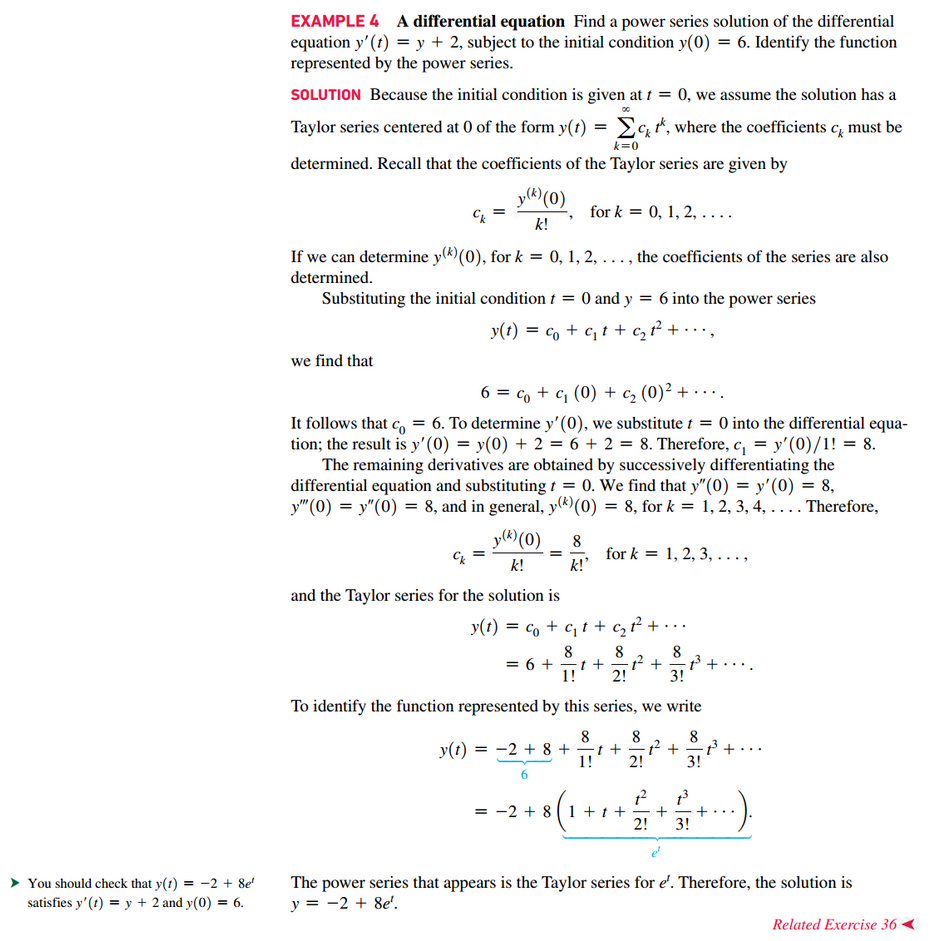

## Integrating Power Series

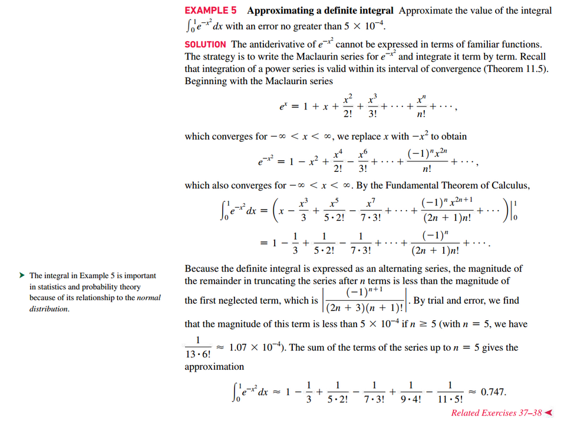

## Representing Real Numbers

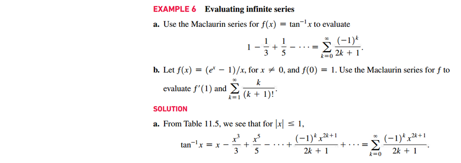
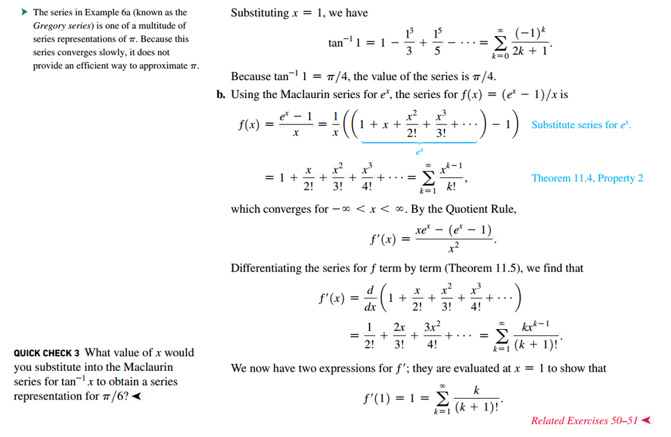

## Representing Functions as Power Series

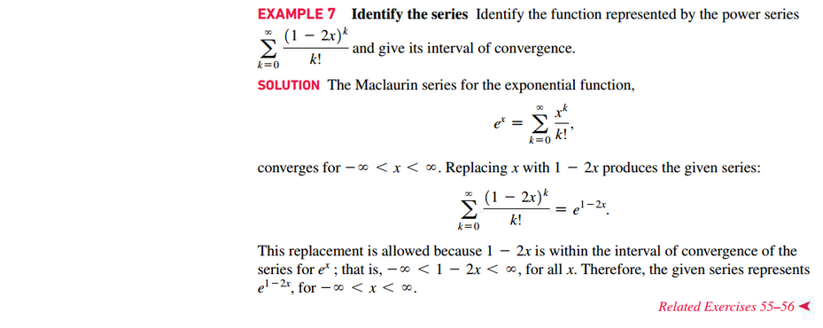

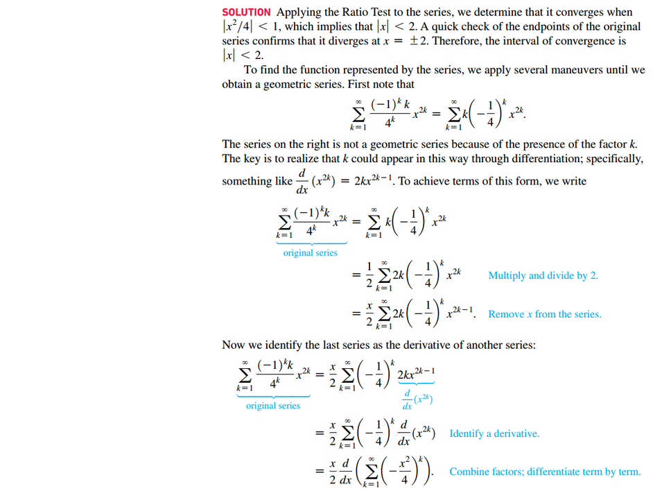
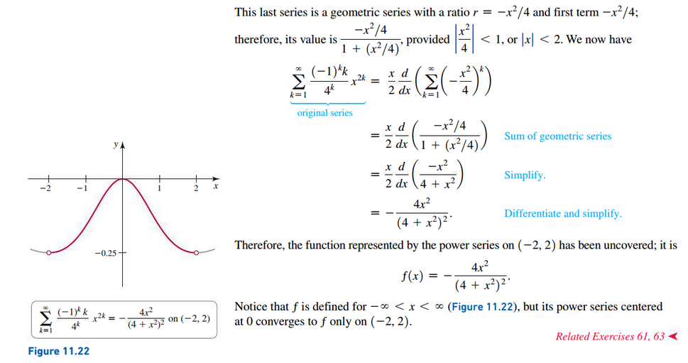

 

# Resources

Textbook

+ Calculus, Early Transcendentals 3rd Edition - Briggs, Cochran, and Gillet

