# Section 12.1: Parametric Equations

## Basic Ideas

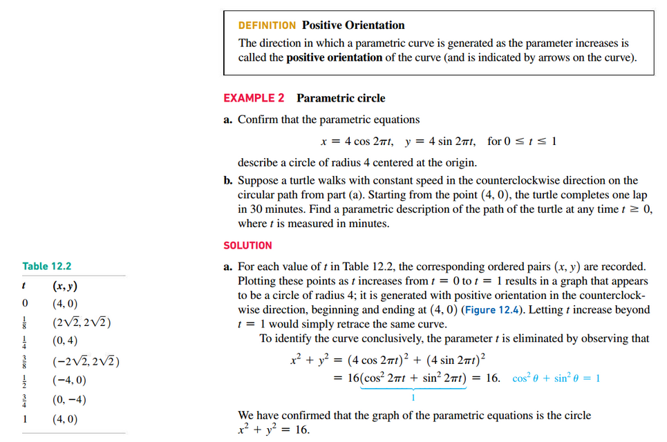
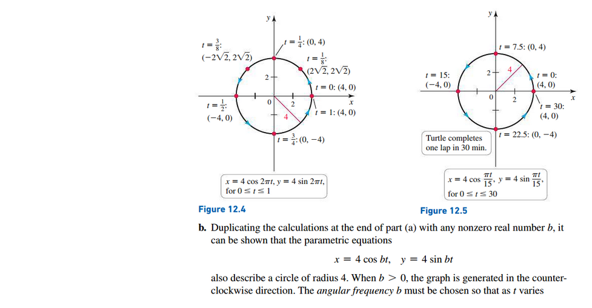
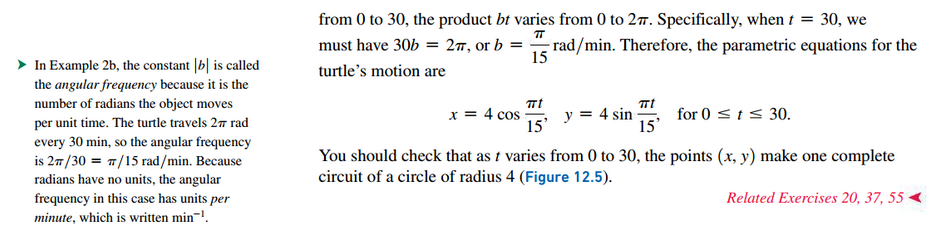

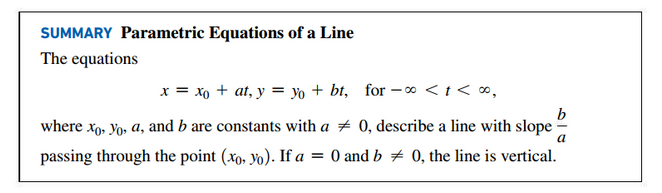

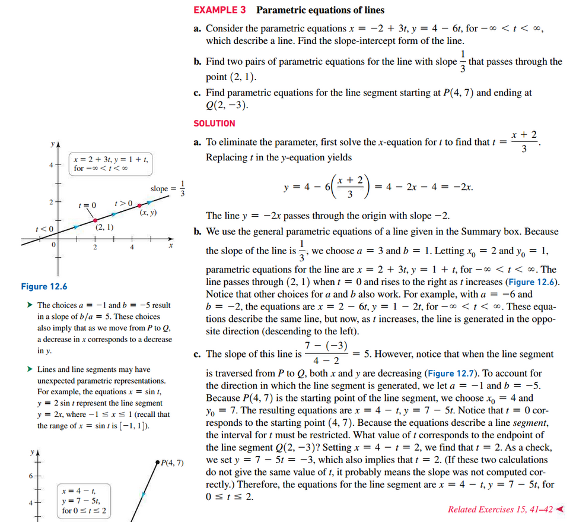

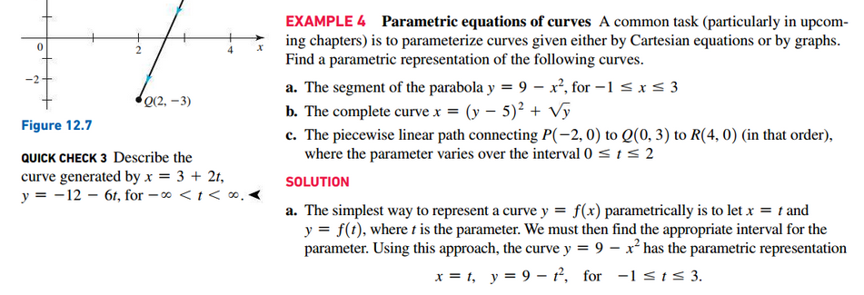
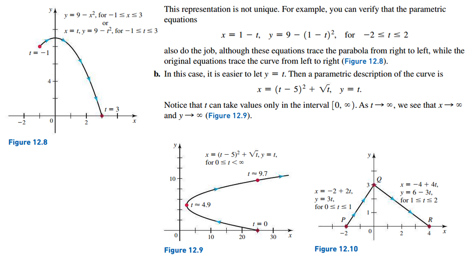
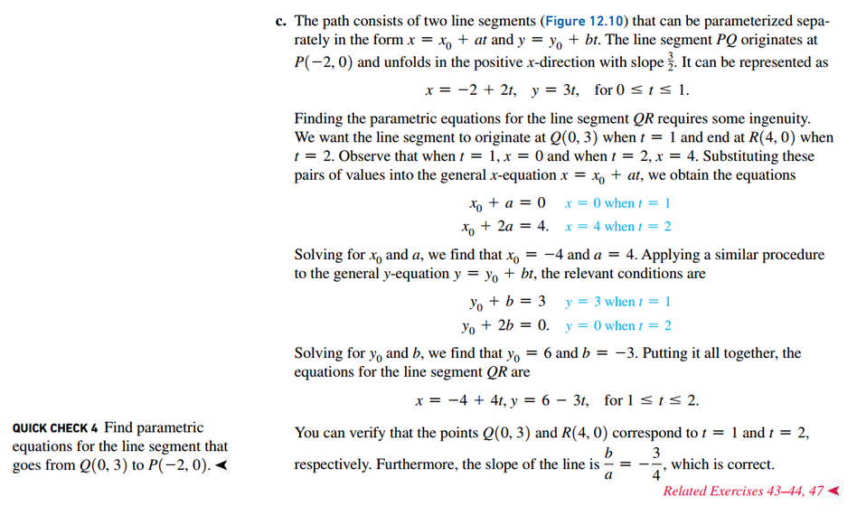

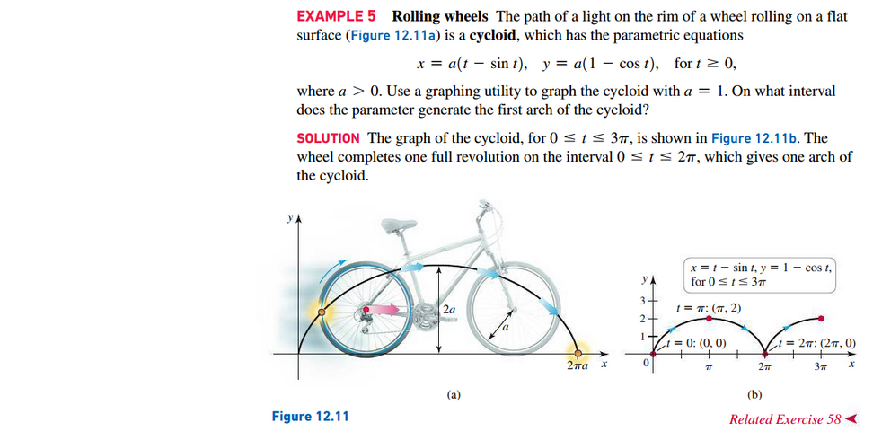

## Derivatives and Parametric Equations

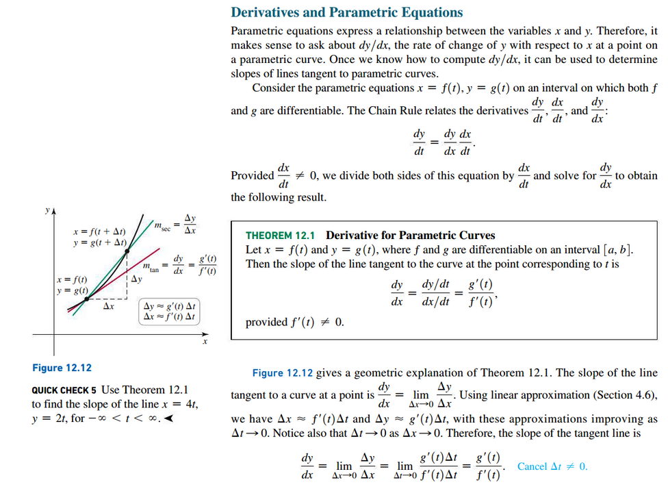

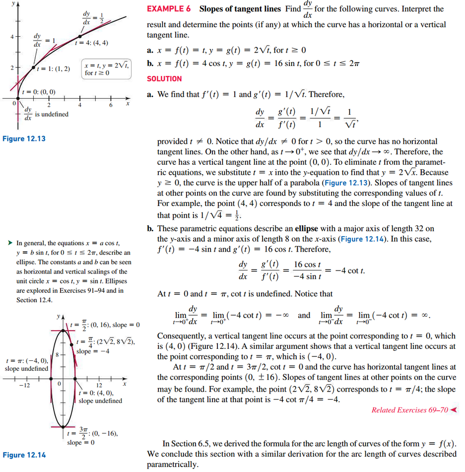

## Arc Length

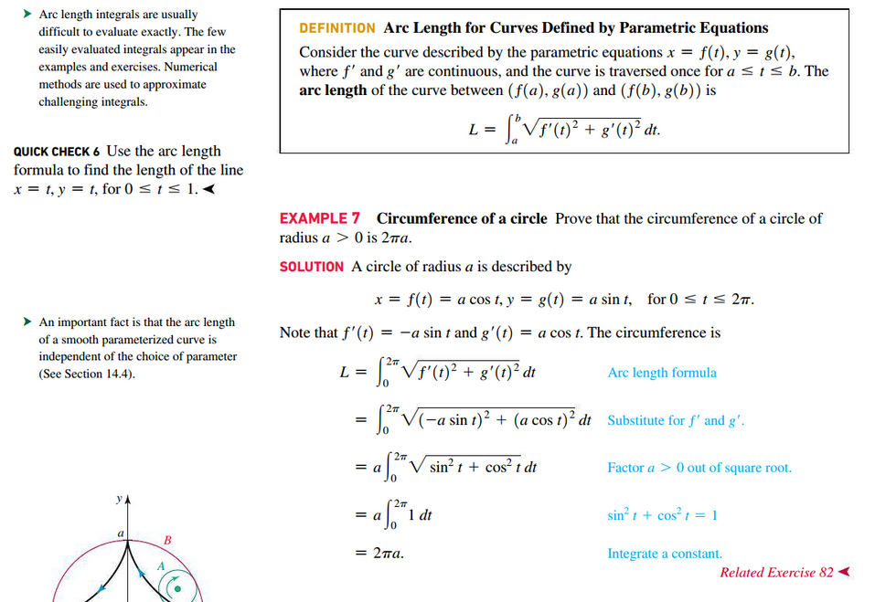

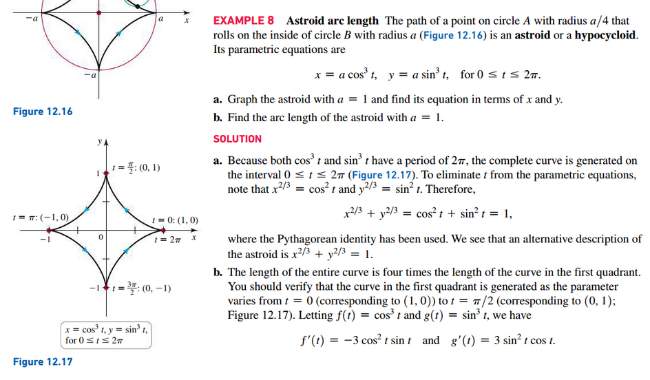
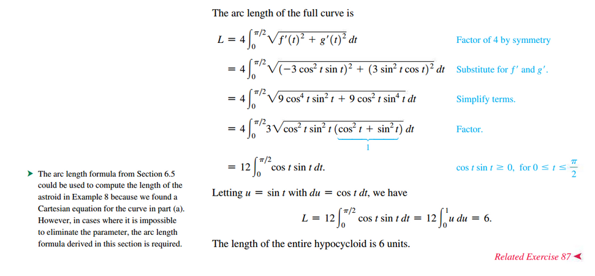

 

# Resources

Textbook

+ Calculus, Early Transcendentals 3rd Edition - Briggs, Cochran, and Gillet

