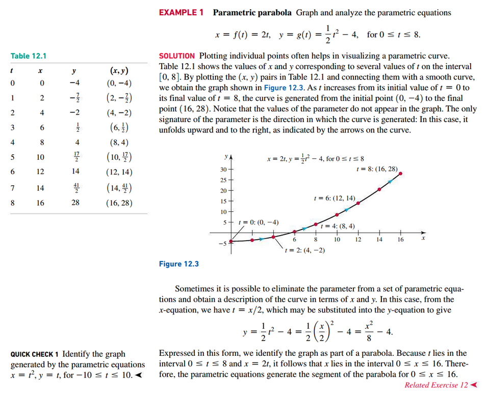

# Section 12.1: Parametric Equations

## Basic Ideas

## Derivatives and Parametric Equations

## Arc Length

 

# Resources

Textbook

+ Calculus, Early Transcendentals 3rd Edition - Briggs, Cochran, and Gillet

