# Section 12.2: Polar Coordinates

## Defining Polar Coordinates

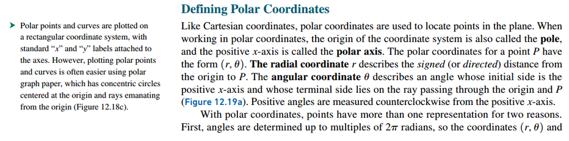
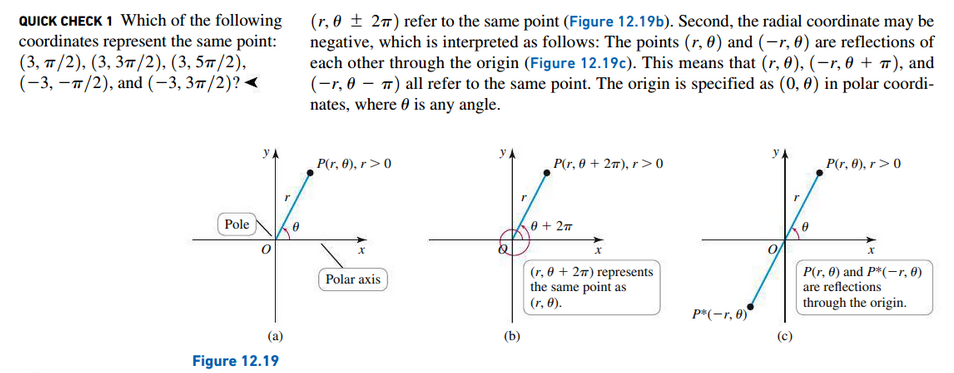

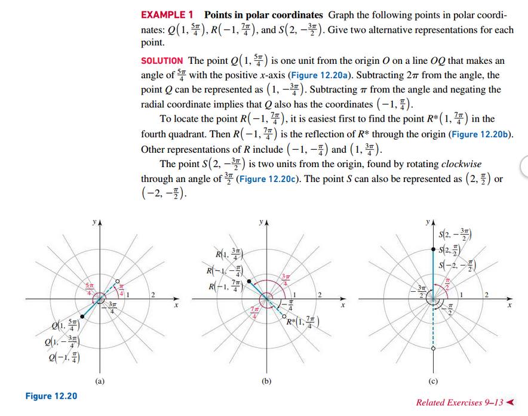

## Converting Between Cartesian and Polar Coordinates

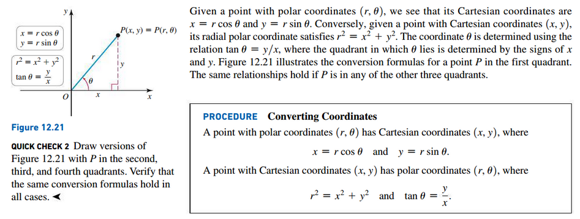

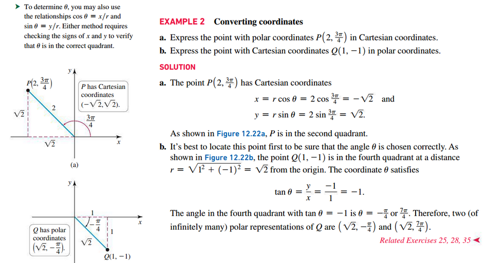

## Basic Curves in Polar Coordinates

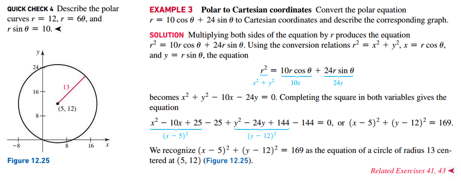

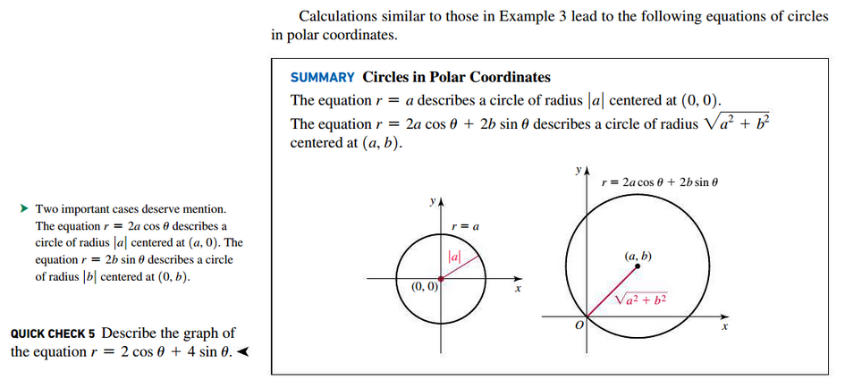

## Graphing in Polar Coordinates

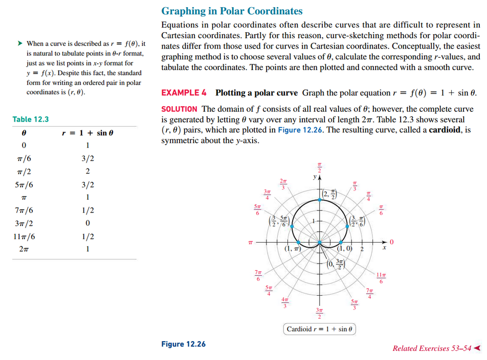

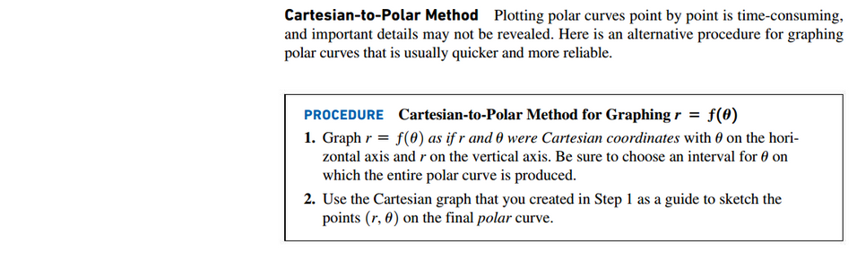

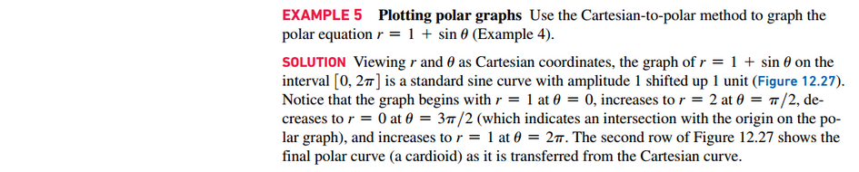
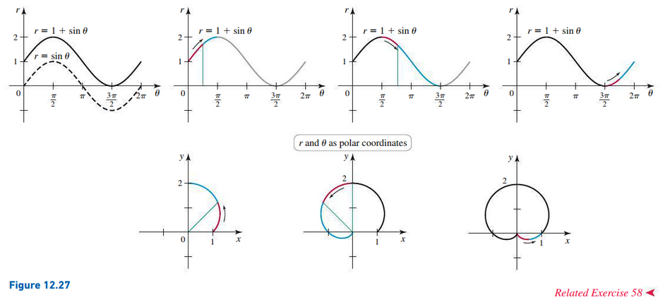

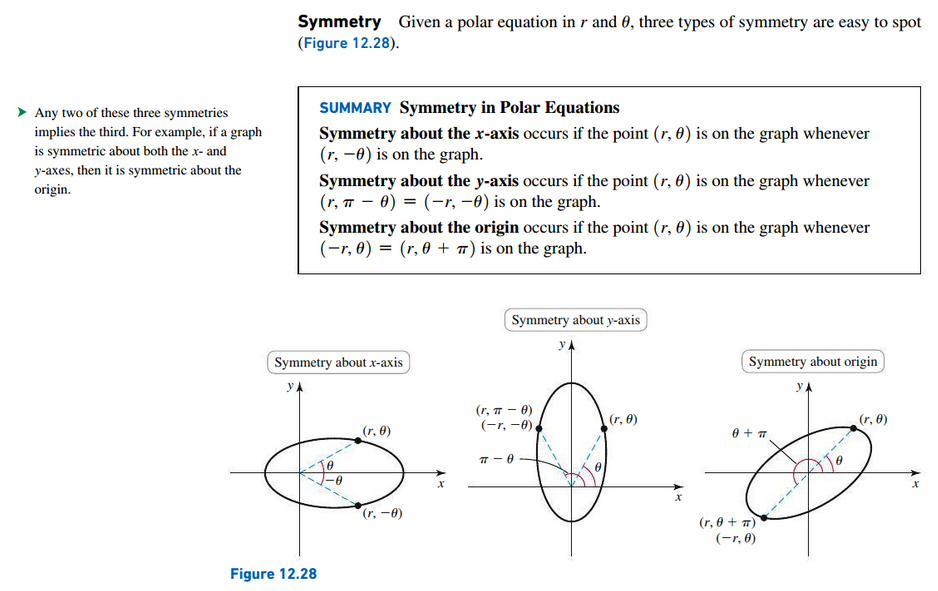

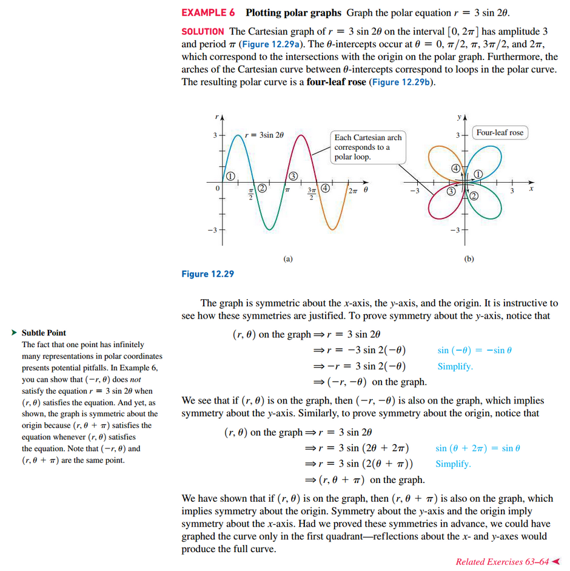

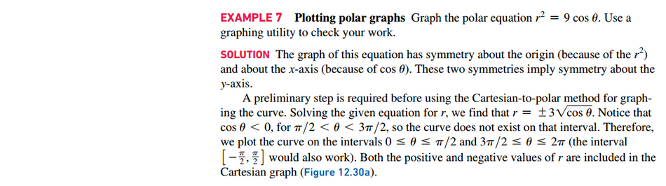
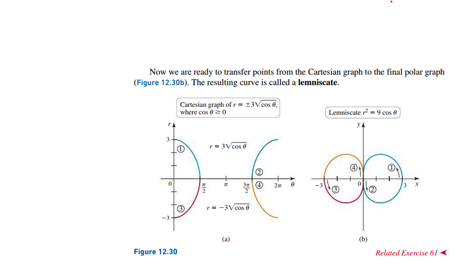

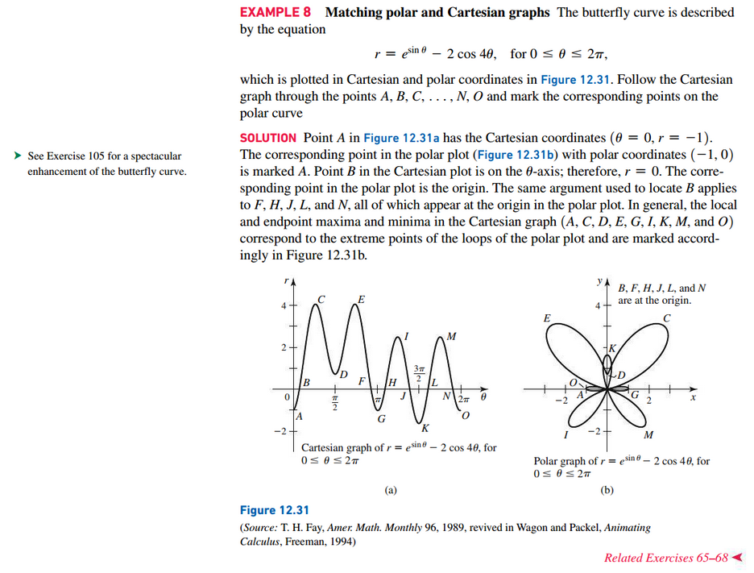

## Using Graphing Utilities

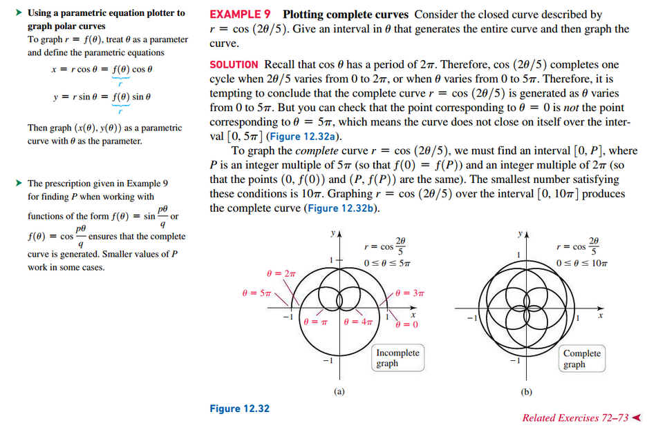

 

# Resources

Textbook

+ Calculus, Early Transcendentals 3rd Edition - Briggs, Cochran, and Gillet

