# Section 12.3: Calculus in Polar Coordinates

## Slopes of Tangent Lines

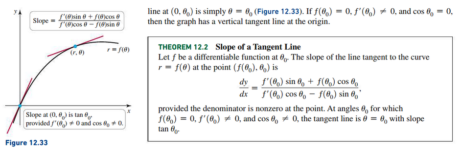

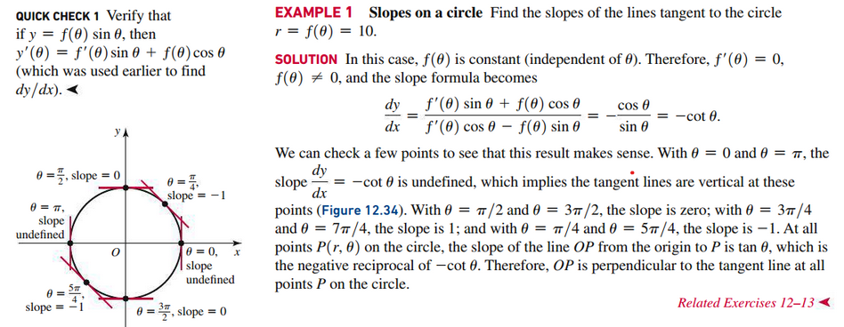

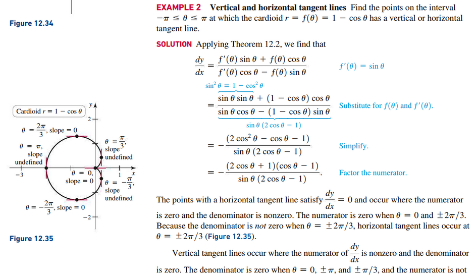
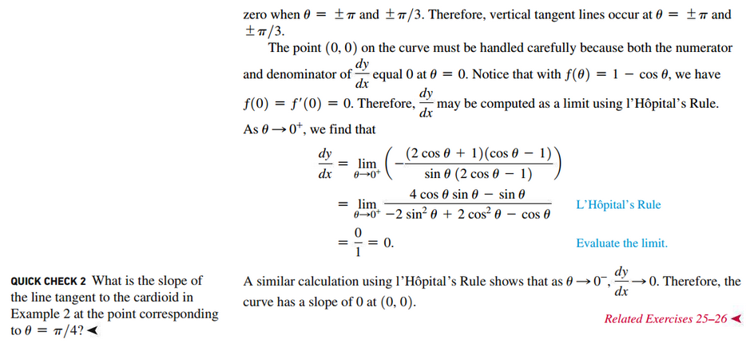

## Area of Regions Bounded by Polar Curves

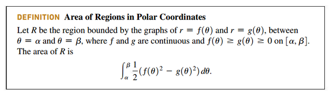

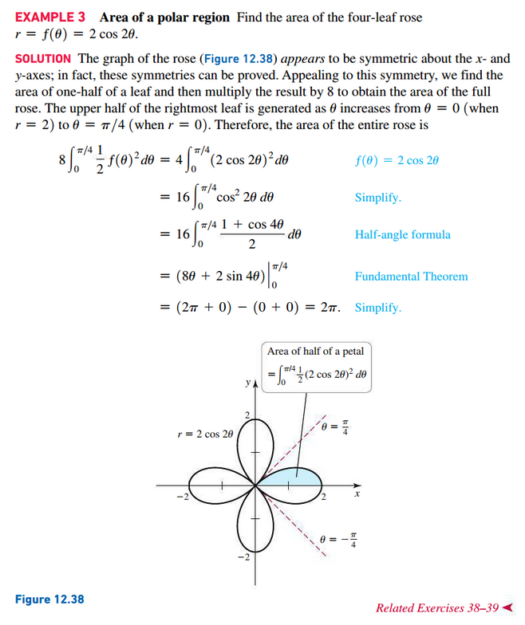

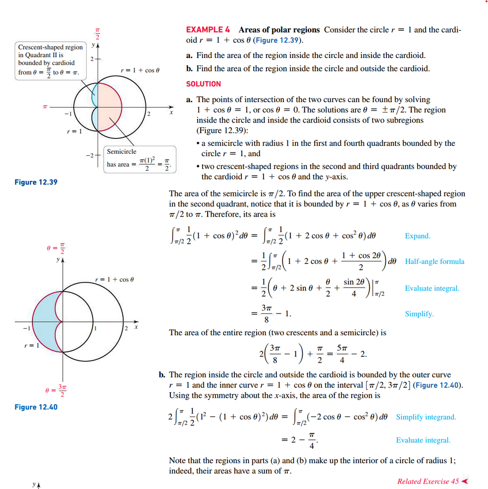

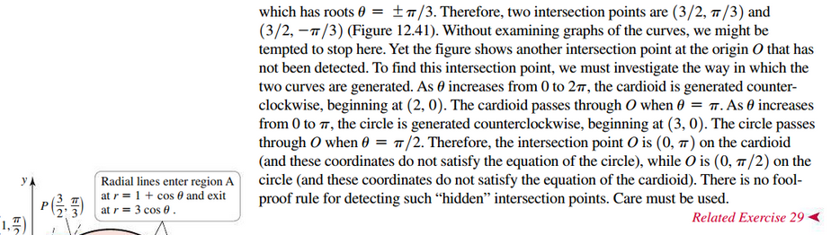

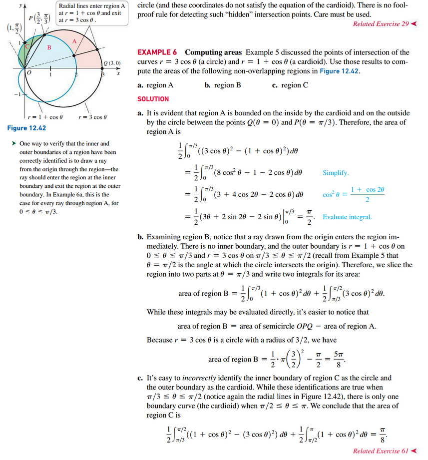

## Arc Length of a Polar Curve

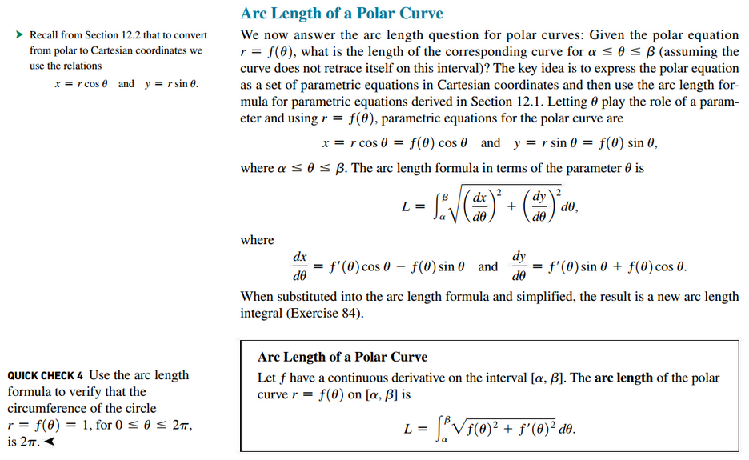

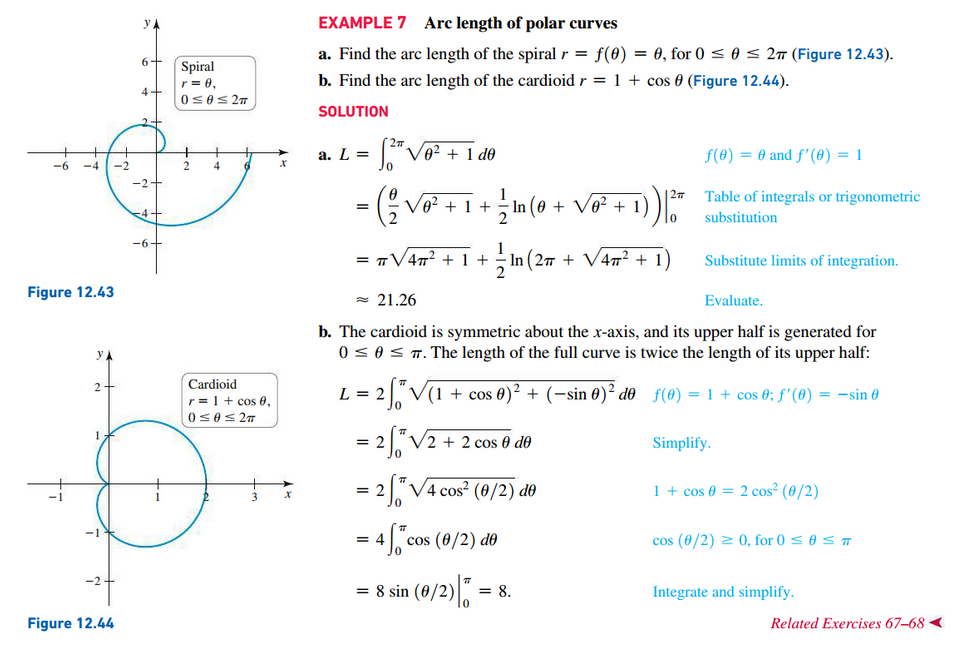

 

# Resources

Textbook

+ Calculus, Early Transcendentals 3rd Edition - Briggs, Cochran, and Gillet

