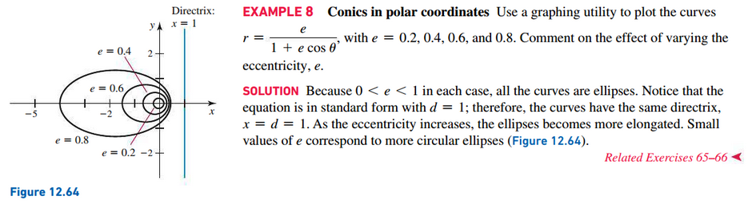

# Section 12.4: Conic Sections

## Parabolas

A **parabola** is a set of points in a plane that are equidistant from a fixed
point $F$ (called the **focus**) and a fixed line (called the **directrix**).

## Ellipses

## Hyperbolas

A **hyperbola** is the set of points in a plane whose distances from two fixed
points have a constant difference, either $2a$ or $-2a$.

## Eccentricity and Directrix

## Polar Equation of Conic Sections

 

# Resources

Textbook

+ Calculus, Early Transcendentals 3rd Edition - Briggs, Cochran, and Gillet

