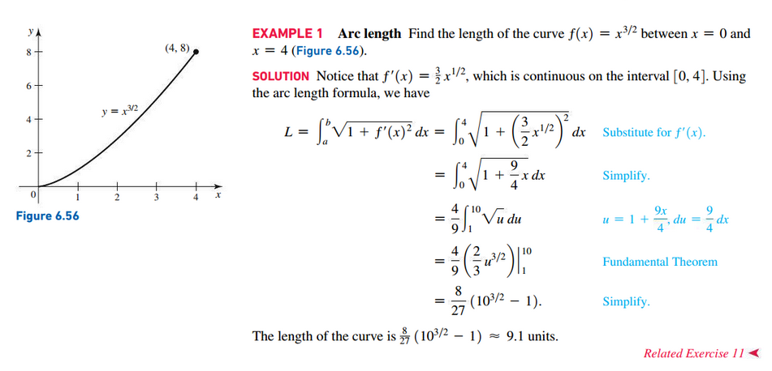
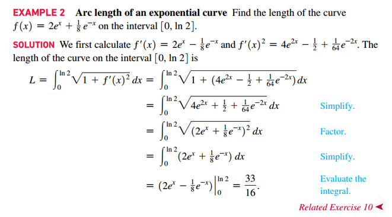
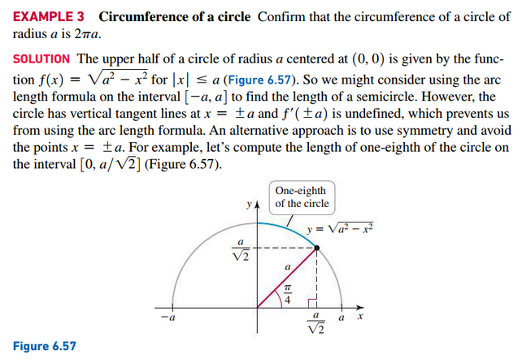
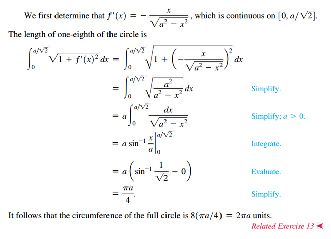
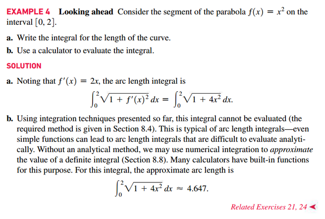
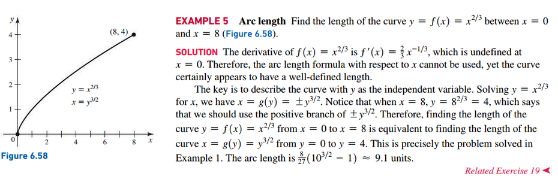
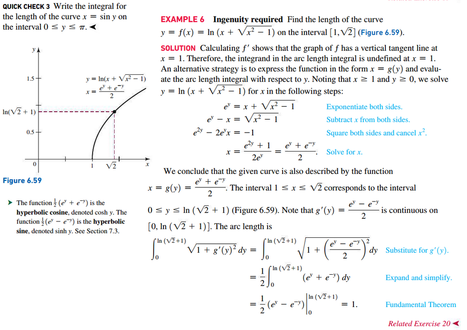

# Section 6.5: Length of Curves

## Definition: Arc Length for $y = f(x)$

Let $f$ have a continuous first derivative on the interval [a, b]. The length of
the curve from (a, f(a)) to (b, f(b)) is

$$
L = \int_{a}^{b} \sqrt{1 + f^{\prime}(x)^{2}}dx
$$

## Video Lectures

- [📺 Arc length intro](https://www.khanacademy.org/math/ap-calculus-bc/bc-applications-of-integration-new/bc-8-13/v/arc-length-formula)
- [📺 Worked example: arc length](https://www.khanacademy.org/math/ap-calculus-bc/bc-applications-of-integration-new/bc-8-13/v/arc-length-example)

## Definition: Arc Length for $x = g(x)$

Let $x = g(y)$ have a continuous first derivative on the interval $[c, d]$. The
length of the curve from $(g(c), c)$ to $(g(d), d)$ is

$$
L = \int_{c}^{d} \sqrt{1 + g^{\prime}(y)^{2}}dy
$$

 

# Resources

- [📺 Arc length intro](https://www.khanacademy.org/math/ap-calculus-bc/bc-applications-of-integration-new/bc-8-13/v/arc-length-formula)
- [📺 Worked example: arc length](https://www.khanacademy.org/math/ap-calculus-bc/bc-applications-of-integration-new/bc-8-13/v/arc-length-example)

Textbook

+ Calculus, Early Transcendentals 3rd Edition - Briggs, Cochran, and Gillet
