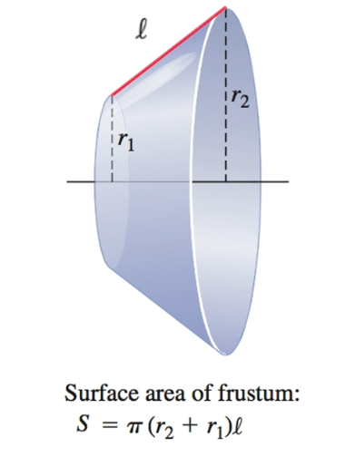
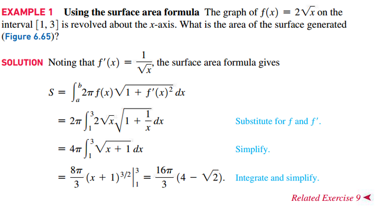
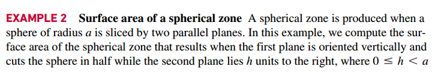
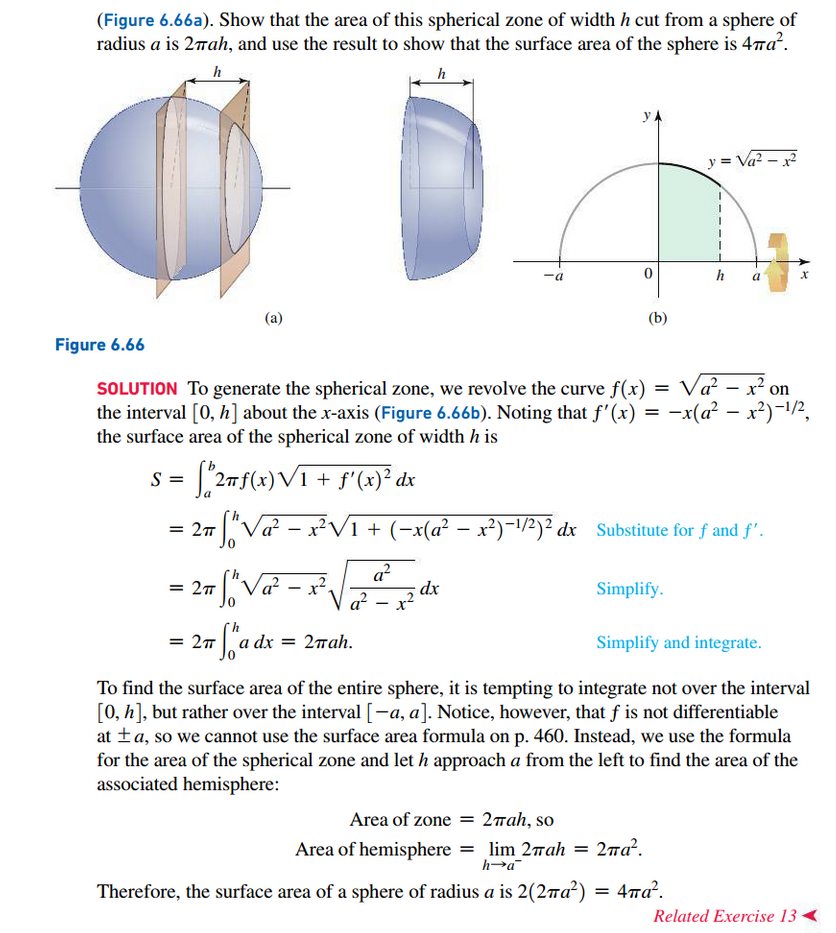
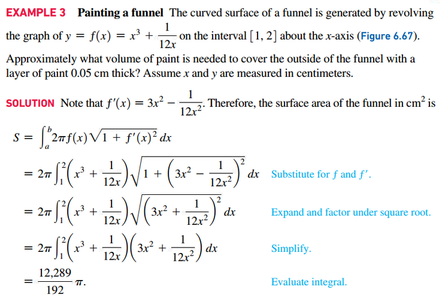
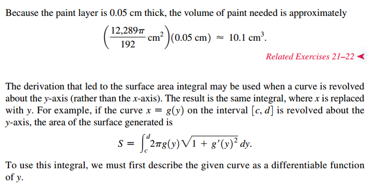
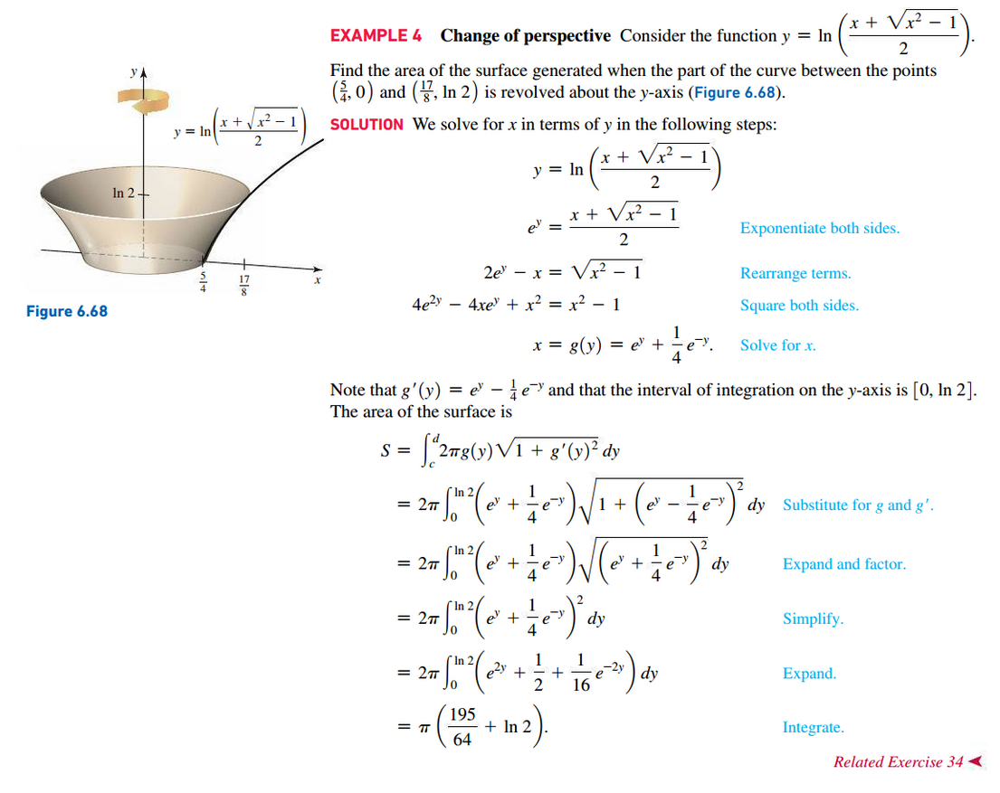

# Section 6.6: Surface Area

## Surface Area of Frustum

$$
S = \pi (r_{2} + r_{1})l
$$

## Definition: Area of a Surface of Revolution

Let $f$ be a nonnegative function with a continuous first derivative on the
interval $[a, b]$. The area of the surface generated when the graph of $f$ on
the interval $[a, b]$ is revolved about the $x$-axis is

$$
S = \int_{a}^{b} 2 \pi f(x) \sqrt{1 + f^{\prime}(x)^{2}}\;dx
$$

## Other Resources

Application of Integration notes from MATH 150

- [↪ Areas Between Curves](../../../../fall-2020/MATH-150/chapters/chapter-6/ch-6-1.md)
- [↪ Volumes](../../../../fall-2020/MATH-150/chapters/chapter-6/ch-6-2.md)
- [↪ Volumes by Cylindrical Shells](../../../../fall-2020/MATH-150/chapters/chapter-6/ch-6-3.md)

 

# Resources

Textbook

+ Calculus, Early Transcendentals 3rd Edition - Briggs, Cochran, and Gillet
