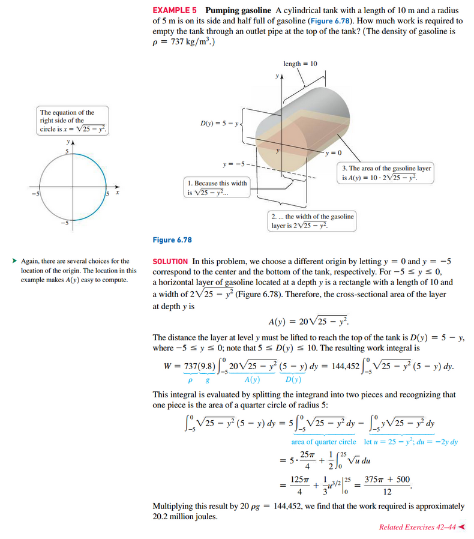

# Section 6.7: Physical Applications

The physical themes in this section are mass, work, force, and pressure.

## Density and Mass

Density is the concentration of mass in an object and is usually measured in
units of mass per volume (for example, $g/cm^{3}$)

$$
\text{mass} \cdot \text{volume}
$$

When the density of an object _varies_, this formula no longer holds, and we
must appeal to calculus.

### Definition: Mass of a One-Dimensional Object

Suppose a thin bar or wire is represented by the interval $a \le x \le b$ with
a density function $p$ (with units of mass per length). The **mass** of the
object is

$$
m = \int_{a}^{b} \rho(x)\;dx
$$

## Work

Work can be described as the change in energy when a force causes a displacement
of an object

$$
\text{work} = \text{force} \cdot \text{distance}
$$

### Definition: Work

The work done by a variable force $F$ moving an object along a line from $x = a$
to $x = b$ in the direction of the force is

$$
W = \int_{a}^{b} F(x)\;dx
$$

## Force and Pressure

Pressure is a force per unit area, measured in units such as newtons per square
meter ($N/m^{2}$).

**Hydrostatic Pressure**

$$
F = \text{mass} \cdot \text{acceleration} = \text{volume} \cdot \text{density}
\cdot g = A h \rho g
$$

where $\rho$ is the density of water and $g$ is the acceleration due to gravity.

$$
\text{pressure} = \frac{\text{force}}{A} = \frac{A h \rho g}{A} = \rho g h
$$

 

# Resources

Textbook

+ Calculus, Early Transcendentals 3rd Edition - Briggs, Cochran, and Gillet
