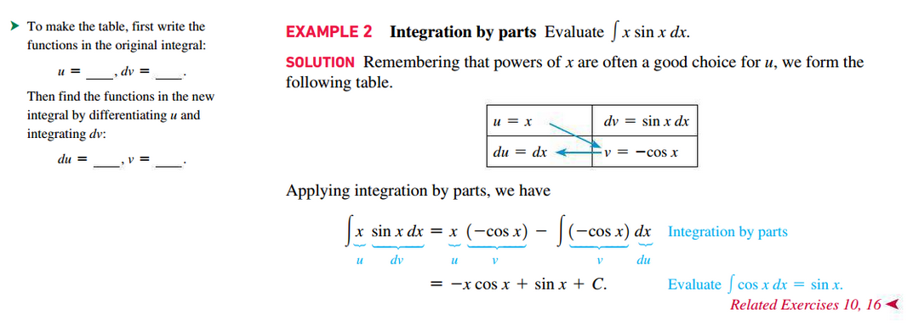
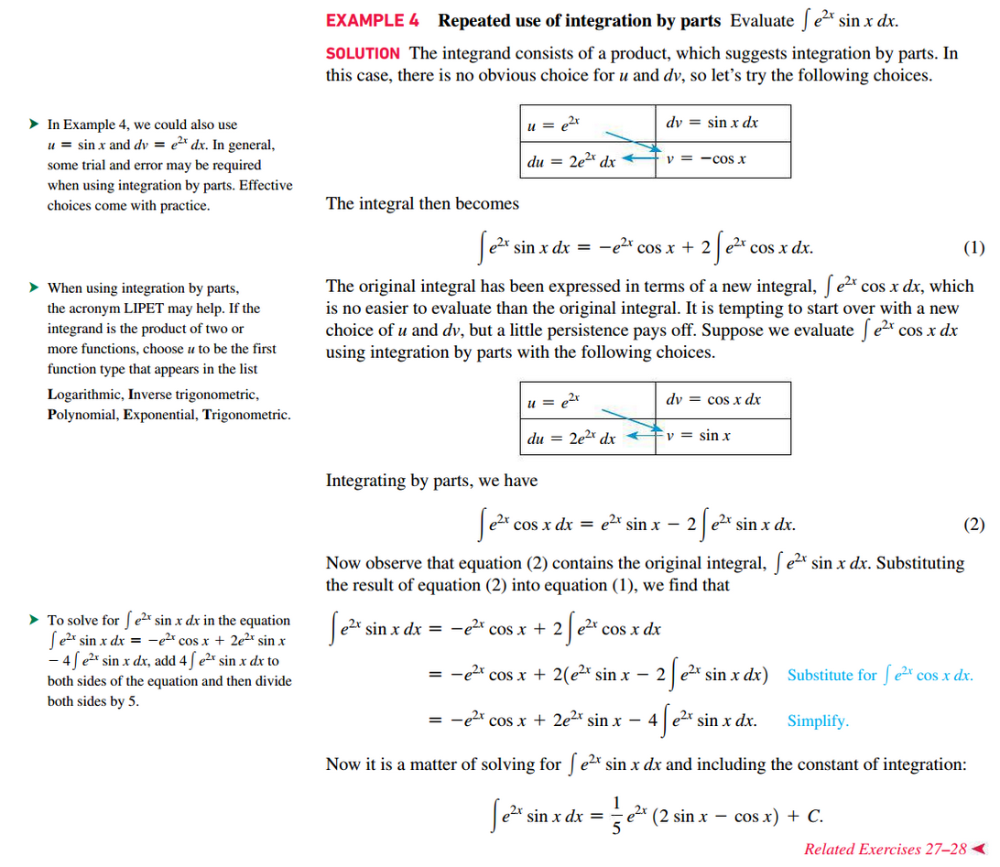
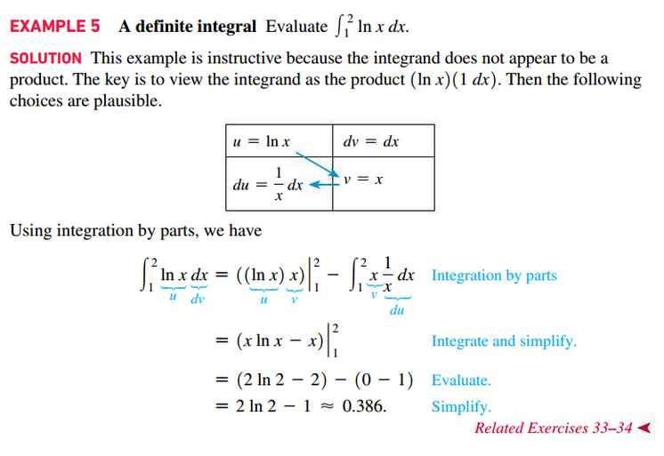
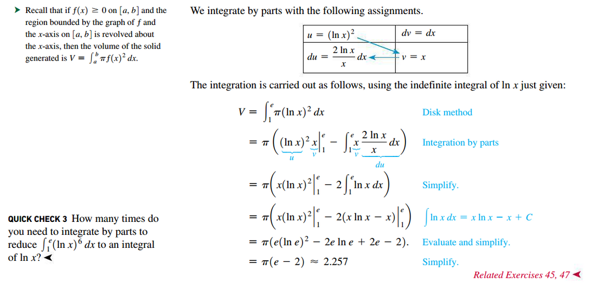

# Section 8.2: Integration by Parts

## Integration by Parts for Indefinite Integrals

Suppose $u$ and $v$ are differentiable functions. Then

$$
\int u\;dv = uv - \int v\;du
$$

### Tips for Choosing $u$ When Integrating by Parts

Use the acronym "LIPET" to help choosing the value when substituting for $u$.

- **L**ogarithmic -- e.g. $\ln(x)$
- **I**nverse Trigonometric -- e.g. $\tan^{-1}(x)$
- **P**olynomial -- e.g. $x^{2}$
- **E**xponential -- e.g. $e^{x}$
- **T**rigonometric -- e.g. $\cos(x)$

to prioritize choosing $u$ in the order of **LIPET**, **L** being the first
priority and **T** being the last.

## Integration by Parts for Definite Integrals

Let $u$ and $v$ be differentiable. Then

$$
\int_{a}^{b} u(x)v^{\prime}(dx)\;dx = \left . u(x)v(x) \right |_{a}^{b} - \int_{a}^{b} v(x)u^{\prime}(x)\;dx
$$

### Integral of $\ln(x)$

$$
\ln(x)\;dx = x\ln(x) - x + C
$$

## External Video Lectures

[📺 Using integration by parts](https://www.khanacademy.org/math/ap-calculus-bc/bc-integration-new/bc-6-11/v/deriving-integration-by-parts-formula)

 

# Resources

- [📺 Using integration by parts](https://www.khanacademy.org/math/ap-calculus-bc/bc-integration-new/bc-6-11/v/deriving-integration-by-parts-formula)

Textbook

+ Calculus, Early Transcendentals 3rd Edition - Briggs, Cochran, and Gillet
