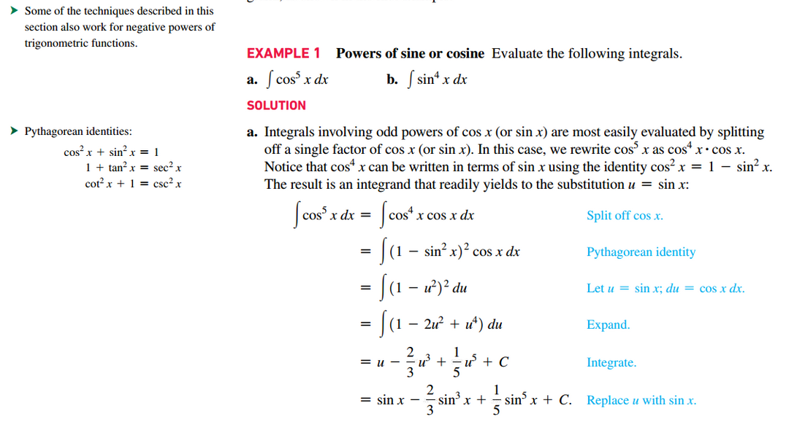
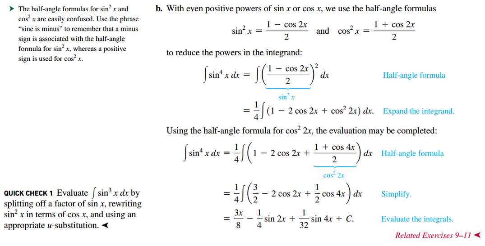
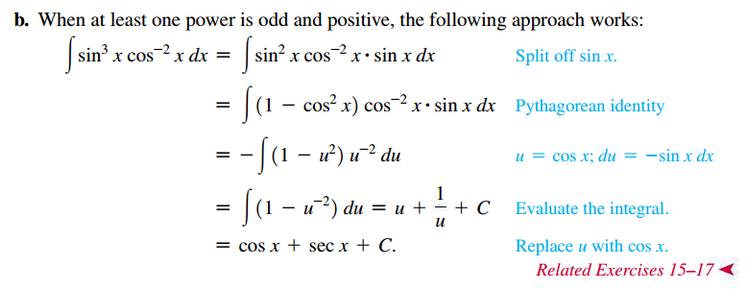
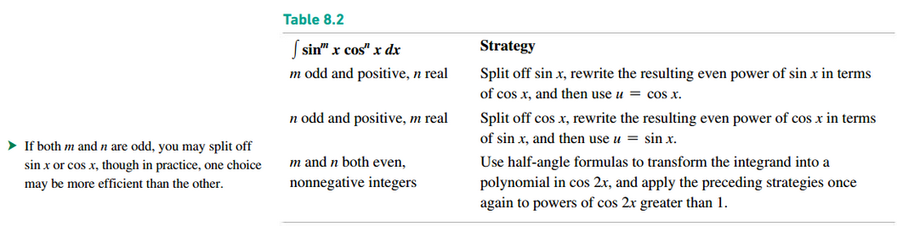
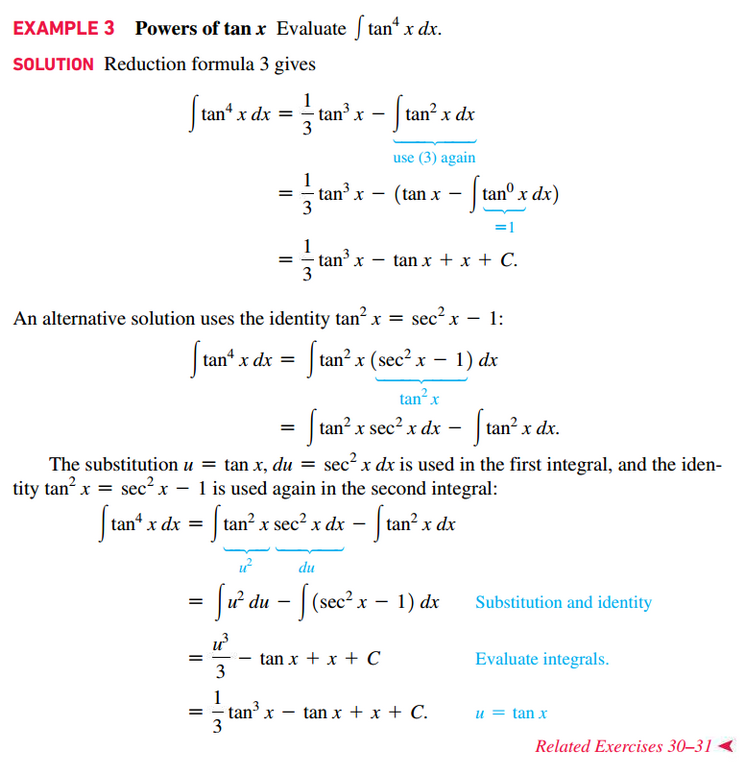
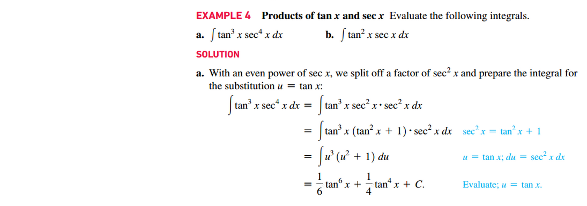
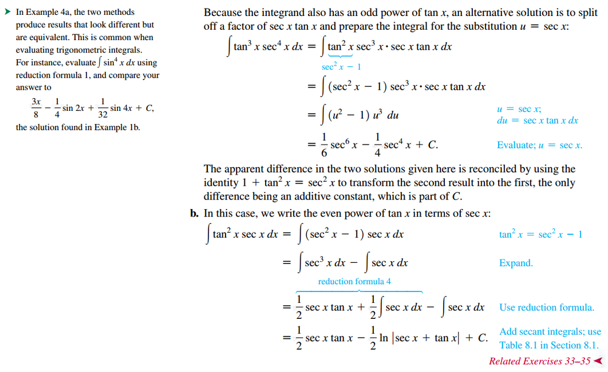
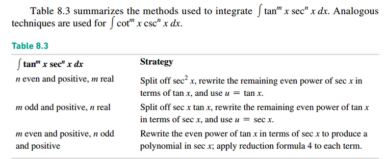

# Section 8.3: Trigonometric Integrals

## Integrating Powers of $\sin(x)$ or $\cos(x)$

## Integrating Products of Powers of $\sin(x)$ and $\cos(x)$

## Reduction Formulas

Assume $n$ is a positive integer.

1. $\int \sin^{n}(x)\;dx = \frac{\sin^{n - 1}(x)\cos(x) }{n} + \frac{n - 1}{n}\int \sin^{n - 2}(x)\;dx$

2. $\int \cos^{n}(x)\;dx = \frac{\cos^{n - 1}(x)\sin(x) }{n} + \frac{n - 1}{n}\int \cos^{n - 2}(x)\;dx$

3. $\int \tan^{n}(x)\;dx = \frac{\tan^{n - 1}(x)}{n - 1} - \int \tan^{n - 2}(x)\;dx, n \neq 1$

4. $\int \sec^{n}(x)\;dx = \frac{\sec^{n - 2}(x)\tan(x)}{n - 1} + \frac{n - 2}{n - 1}\int \sec^{n - 2}(x)\;dx, n \neq 1$

## Integrating Producsts of Powers of $\tan(x)$ and $\sec(x)$

## External Video Lectures

[📺 Trigonometric Integrals](https://www.youtube.com/watch?v=flvhNBoOsiA)

 

# Resources

Textbook

+ Calculus, Early Transcendentals 3rd Edition - Briggs, Cochran, and Gillet
