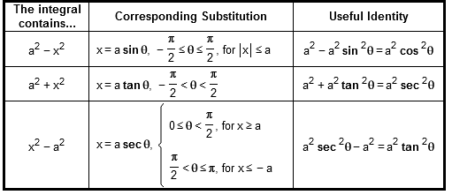
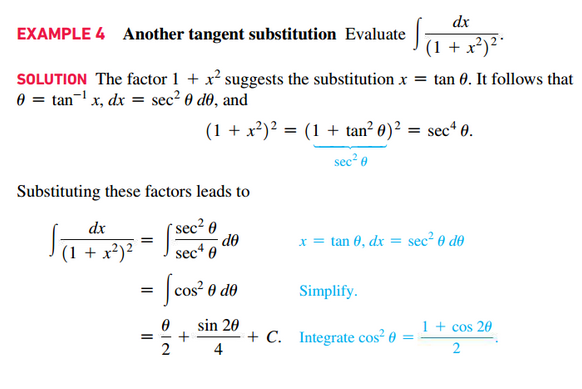

# Section 8.4: Trigonometric Substitutions

## Integrals Involving $a^{2} - x^{2}$

$$
\begin{aligned}
	a^{2} - x^{2} &= a^{2} - (a \sin(\theta))^{2} \;\;\; {\color{#0000ff}{\text{ Replace } x \text{ with } a \sin(\theta)}} \\
	 &= a^{2} - a^{2}\sin^{2}(\theta) \\
	 &= a^{2}(1 - \sin^{2}(\theta)) \\
	 &= a^{2}\cos^{2}(\theta) \\
\end{aligned}
$$

From the Pythagorean Theorem: $a^{2} + b^{2} = c^{2} = \sqrt{a^{2} + b^{2}}$

## Integrals Involving $a^{2} + x^{2}$ or $x^{2} - a^{2}$

### Trigonometric Substitution

#### $a^{2} - x^{2}$ with sine

If the integral involves $a^{2} - x^{2}$ (where $a > 0$) then substitute $x
= a \sin(\theta)$. The substitution is well defined for $-\frac{\pi}{2} \le
\theta \le \frac{\pi}{2}$.

#### $a^{2} + x^{2}$ with tangent

If the integral involves $a^{2} + x^{2}$ (where $a > 0$) then substitute $x
= a \tan(\theta)$. The substitution is well defined for $-\frac{\pi}{2} < \theta
< \frac{\pi}{2}$.

#### $x^{2} - a^{2}$ with secant

If the integral involves $x^{2} - a^{2}$ (where $a > 0$) then substitute $x
= a \sec(\theta)$. The substitution is well defined for $0 \le \theta
< \frac{\pi}{2}$ when $x \ge a$ and for $\frac{\pi}{2} < \theta \le \pi$ when $x
\le -a$.

 

# Resources

Textbook

+ Calculus, Early Transcendentals 3rd Edition - Briggs, Cochran, and Gillet
