# Section 8.5: Partial Fractions

## Method of Partial Fractions

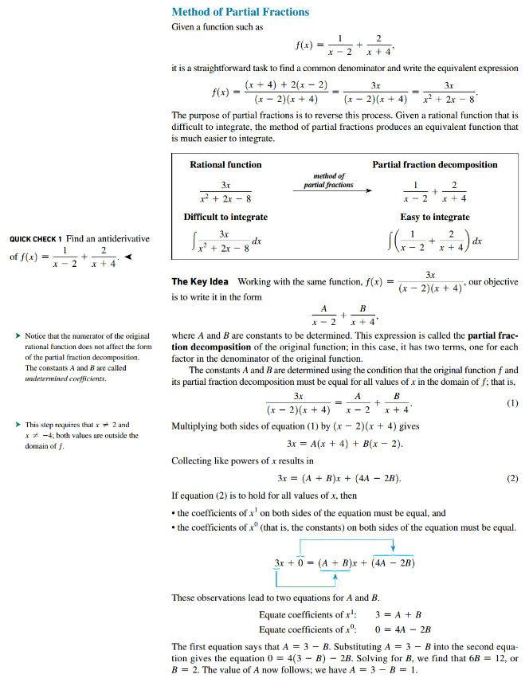

## Simple Linear Factors

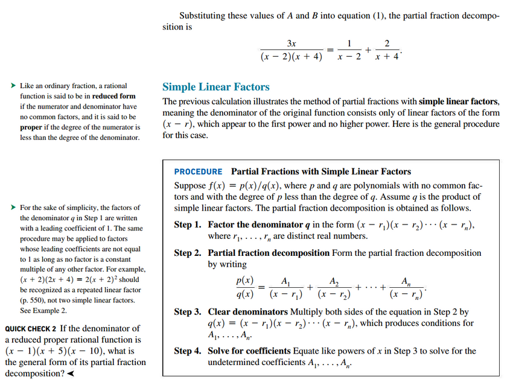

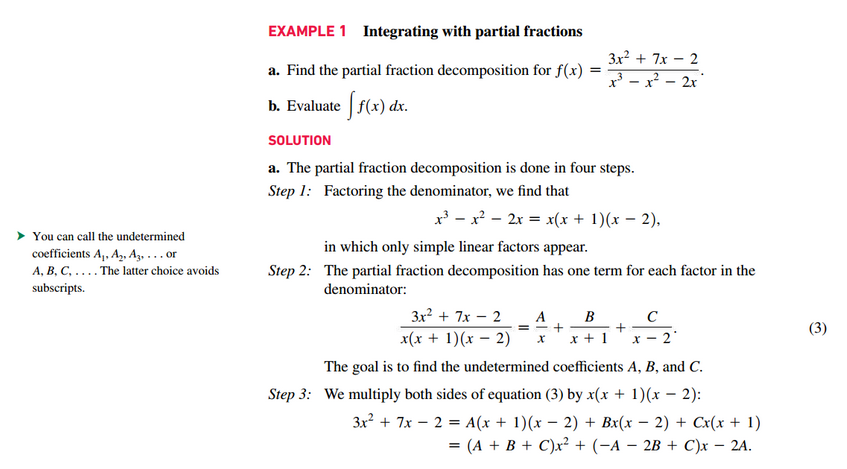
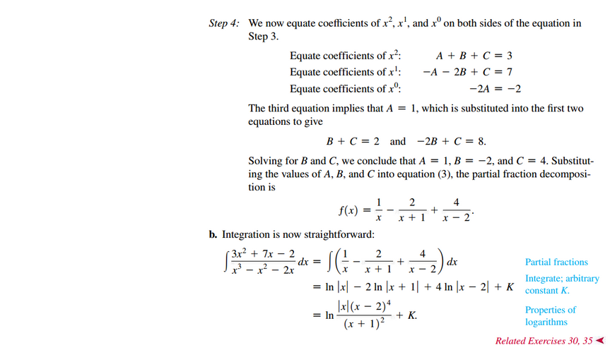
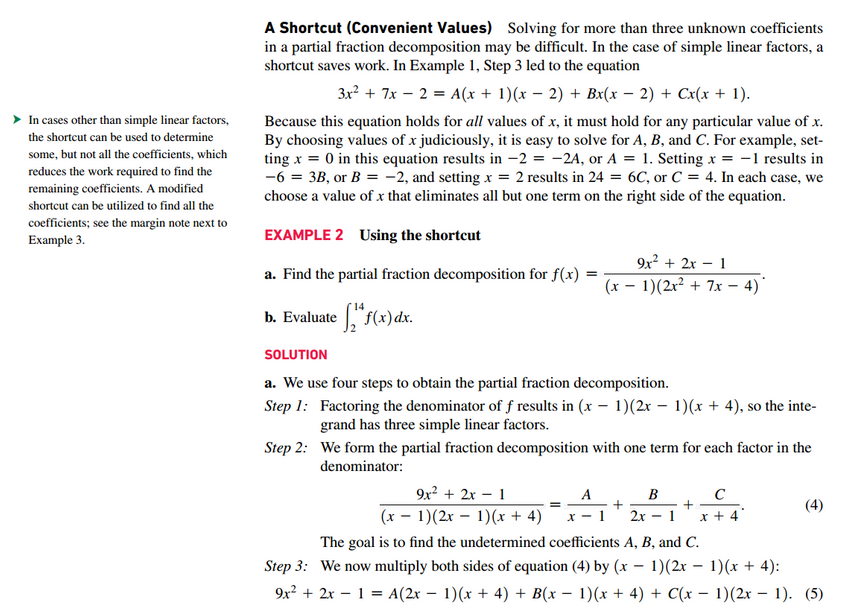
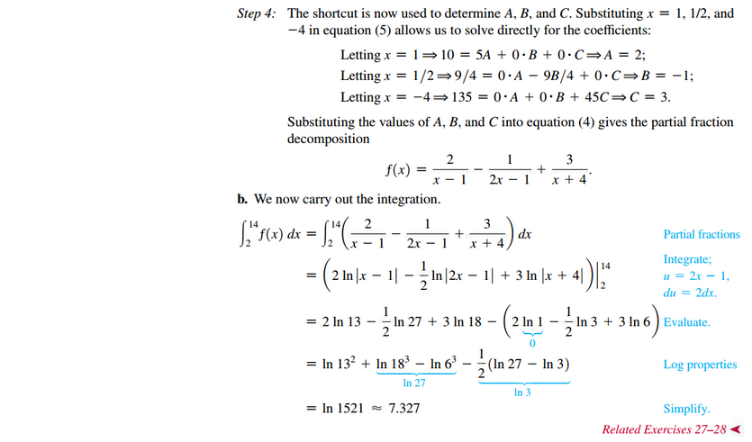

## Repeated Linear Factors

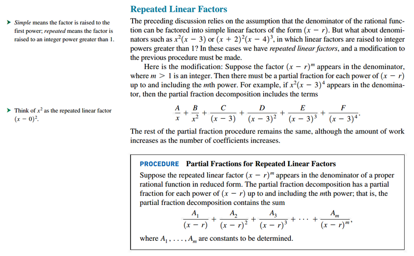

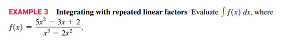
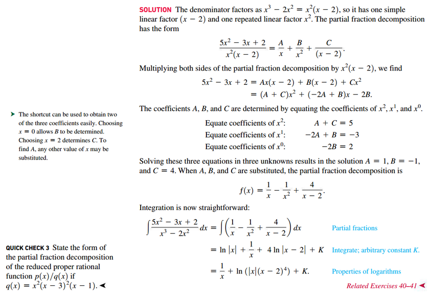

## Irreducible Quadratic Factors

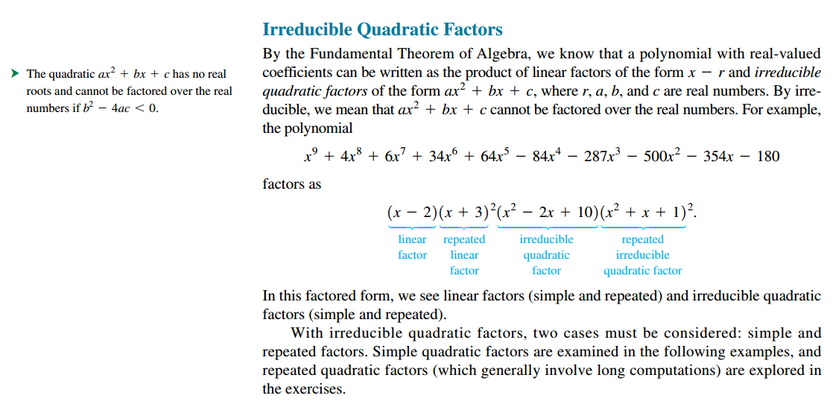
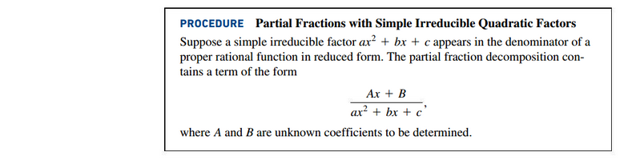

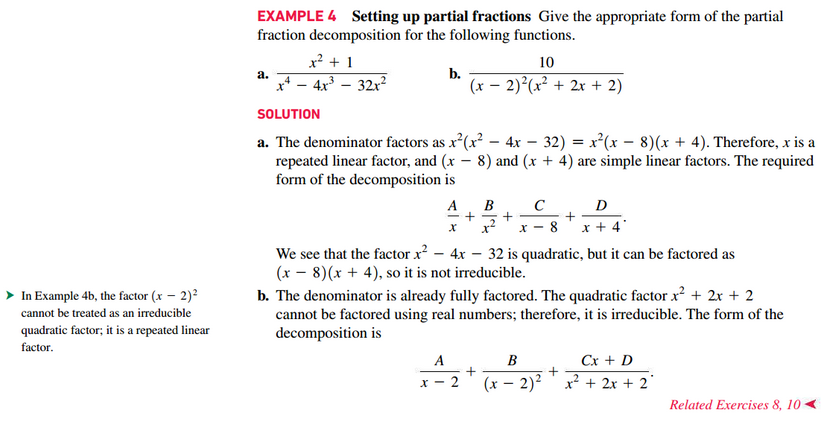
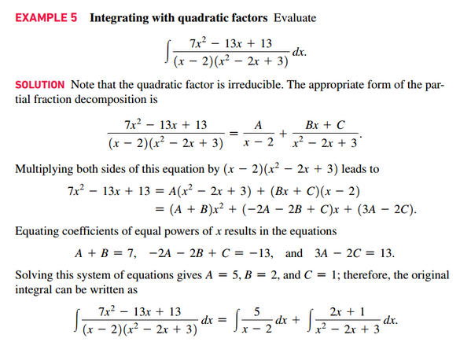
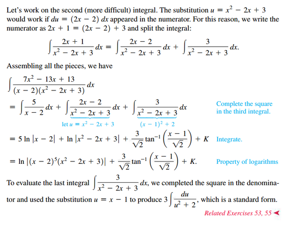

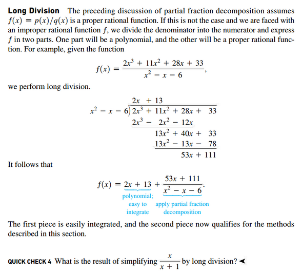

 

# Resources

Textbook

+ Calculus, Early Transcendentals 3rd Edition - Briggs, Cochran, and Gillet
