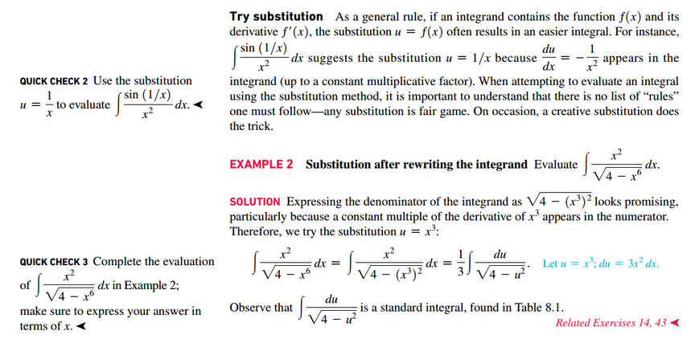
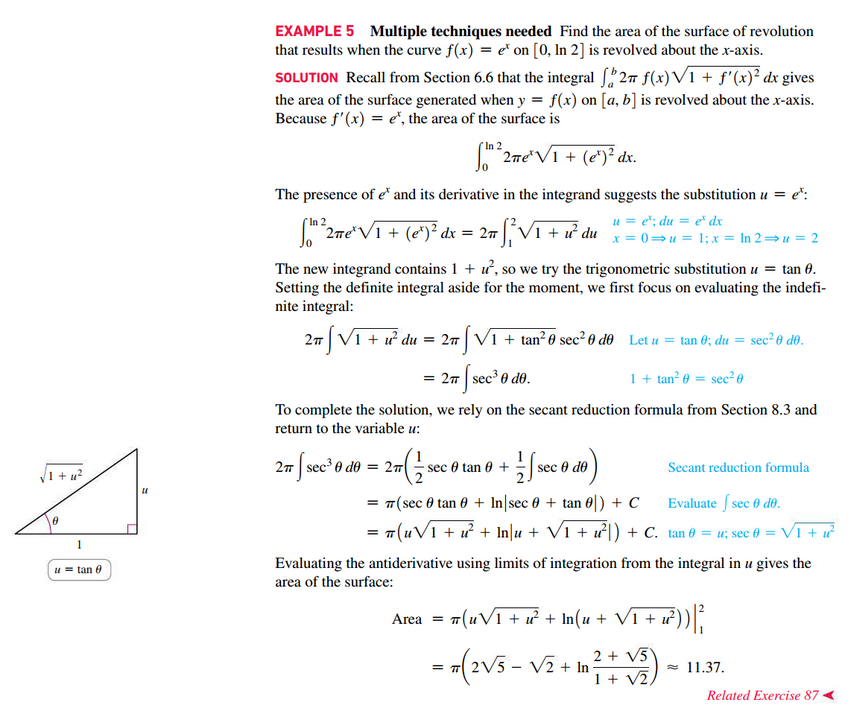

# Section 8.6: Integration Strategies

## Recognize A Common Pattern Present in the Integrand

1. Integrating the product of two functions often calls for integration by parts
	 (Section 8.2), particularly if the factors of the product are a polynomial
	 and a transcendental function (a logarithmic, exponential, trigonometric, or
	 inverse trigonometric function). In some cases, integegration by parts is
	 successful when the integrand is a single function (for example, $\int
	 \ln(x)\;dx$ or $\int \sin^{-1}(x)\;dx$)
2. Powers and products or $\sin(x)$ and $\cos(x)$, $\tan(x)$ and $\sec(x)$, or
	 $\cot(x)$ and $\csc(x)$ are integrated using identities, reduction formulas,
	 or the substitutions given in Tables 8.2 and 8.3 of [📑 Section
	 8.3](./sec_8-3.md#section-8.3-trigonometric-integrals).
3. Integrals containing the expression $a^{2} - x^{2}, a^{2} + x^{2}$, or $x^{2}
	 - a^{2}$ may yield to trigonometric substitution. Use the substitutions given
	 in Table 8.4 of [📑 Section
	 8.4](./sec_8-4.md#section-8.4-trigonometric-substitutions) to tackle such
	 integrals, but don't overlook a simpler solution. For example, $\int
	 \frac{x}{1 - x^{2}}\;dx$ is most easily evaluatied using the substitution $u
	 = 1 - x^{2}$ rather than $x = \sin(\theta)$
4. Use partial fraction decomposition ([📑 Section
	 8.5](./sec_8-5.md#section-8.5-partial-fractions)) to integrate rational
	 functions. Remember to first cancel common factors and to apply long division
	 if the rational function is not proper.

 

# Resources

- [📑 Section 8.3](./sec_8-3.md#section-8.3-trigonometric-integrals)
- [📑 Section 8.4](./sec_8-4.md#section-8.4-trigonometric-substitutions)
- [📑 Section 8.5](./sec_8-5.md#section-8.5-partial-fractions)

Textbook

+ Calculus, Early Transcendentals 3rd Edition - Briggs, Cochran, and Gillet
