# Section 8.8: Numerical Integration

## Absolute and Relative Error

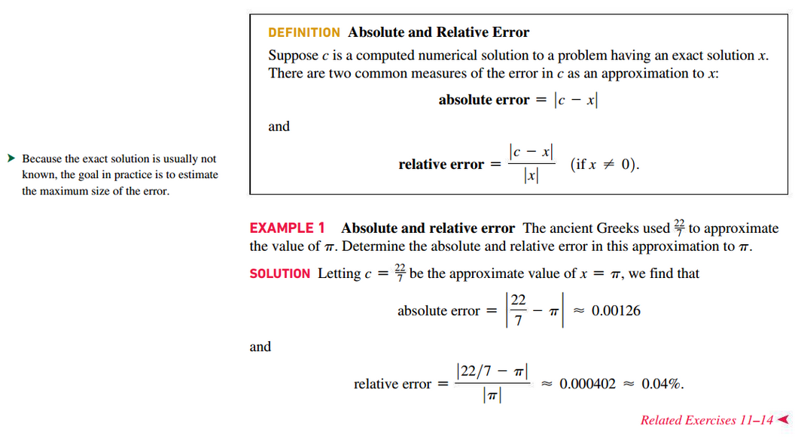

## Midpoint Rule

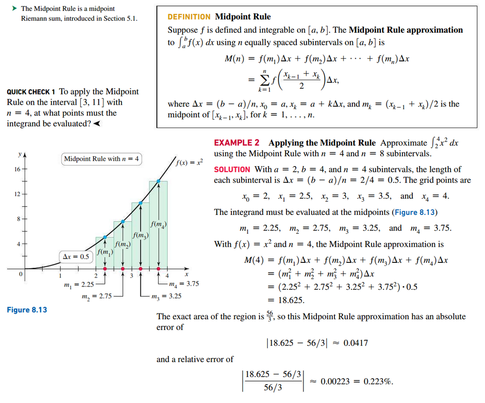
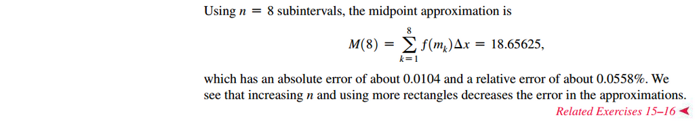

## Trapezoid Rule

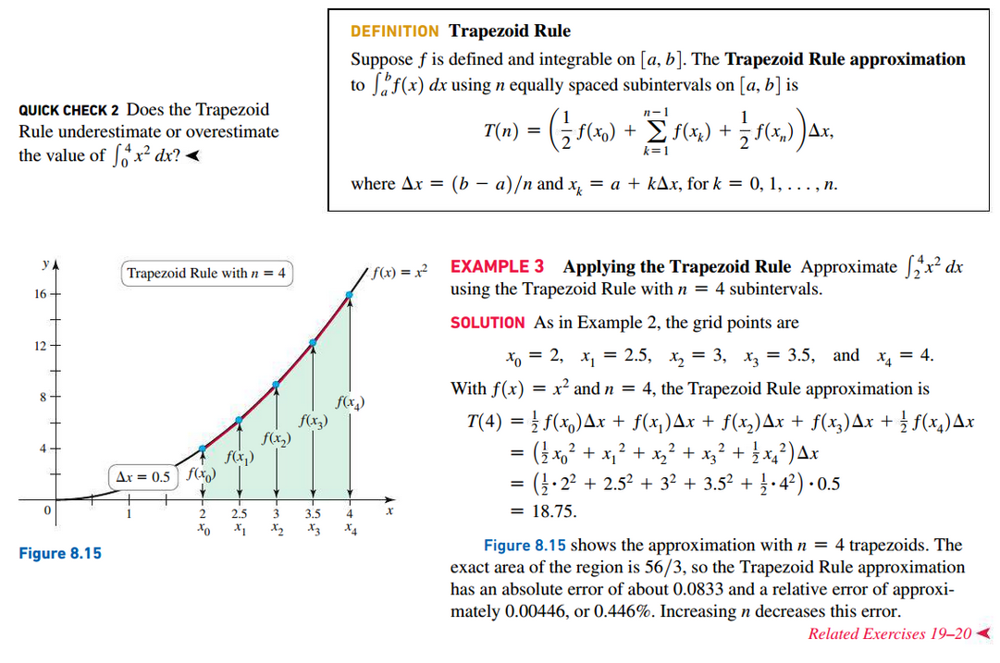
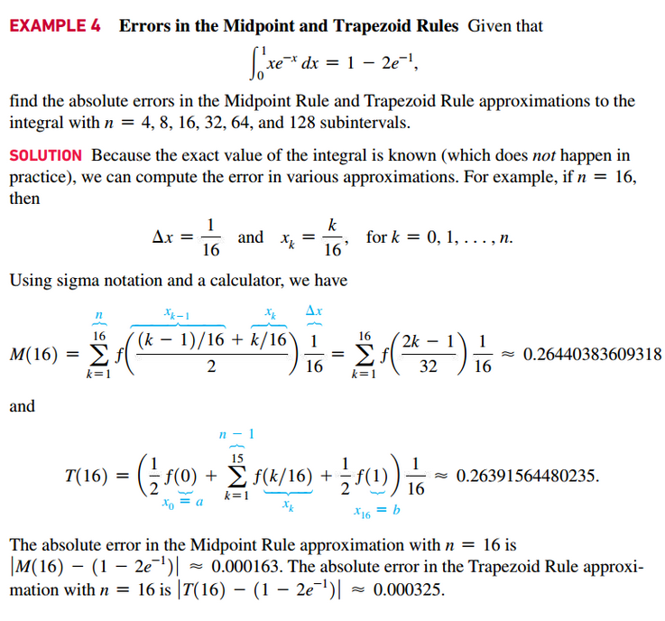
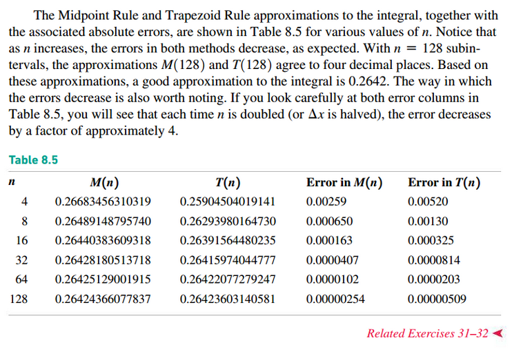

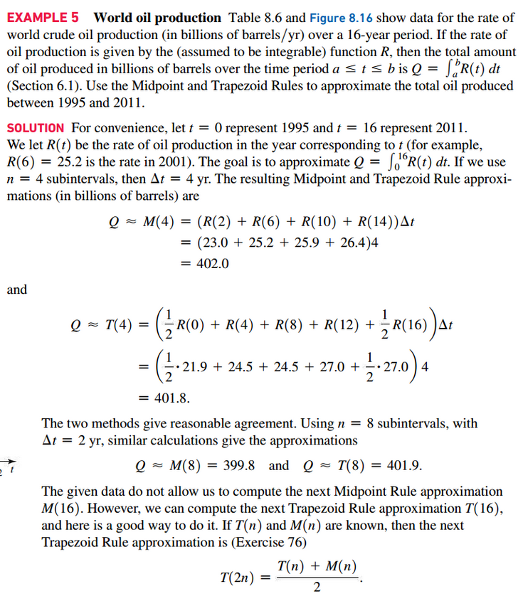
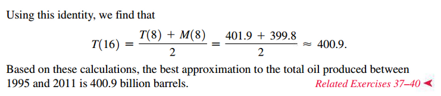
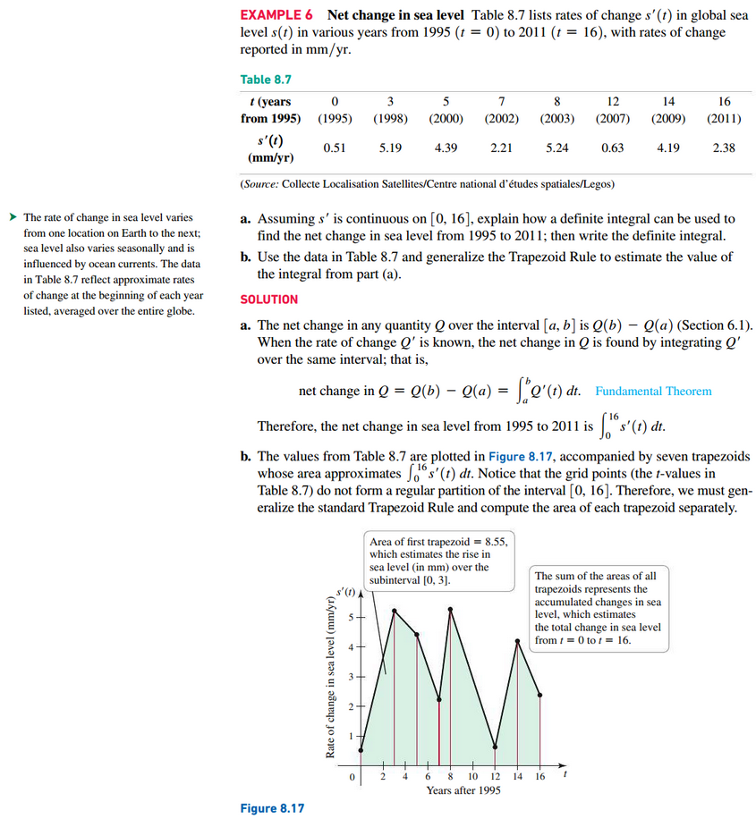
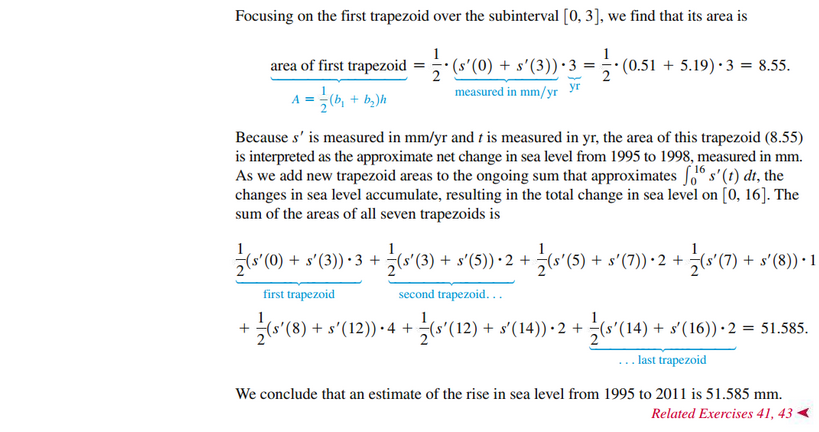

## Simpson's Rule

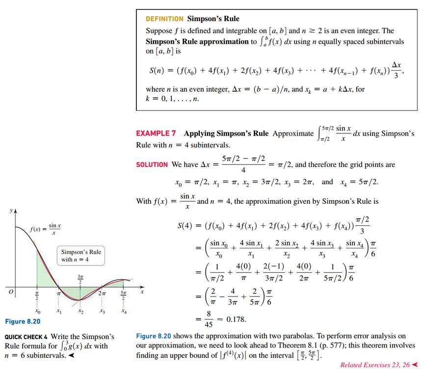
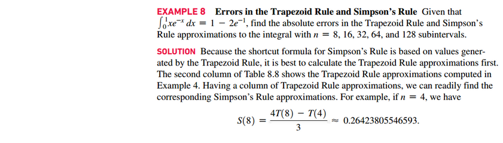
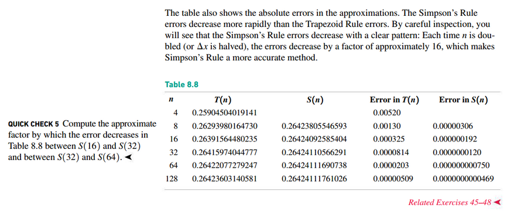

## Errors in Numerical Integration

 

# Resources

Textbook

+ Calculus, Early Transcendentals 3rd Edition - Briggs, Cochran, and Gillet
