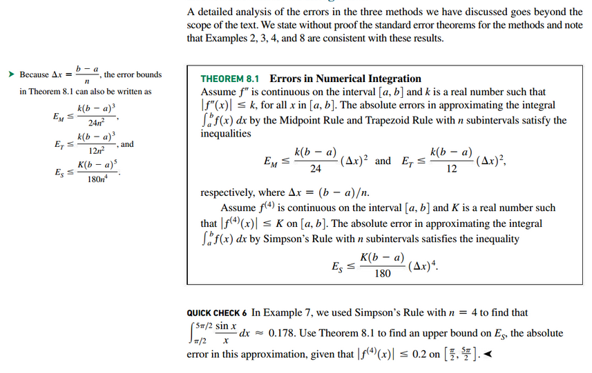

# Section 8.8: Numerical Integration

## Absolute and Relative Error

## Midpoint Rule

## Trapezoid Rule

## Simpson's Rule

## Errors in Numerical Integration

 

# Resources

Textbook

+ Calculus, Early Transcendentals 3rd Edition - Briggs, Cochran, and Gillet
