# Section 8.9: Improper Integrals

## Infinite Intervals

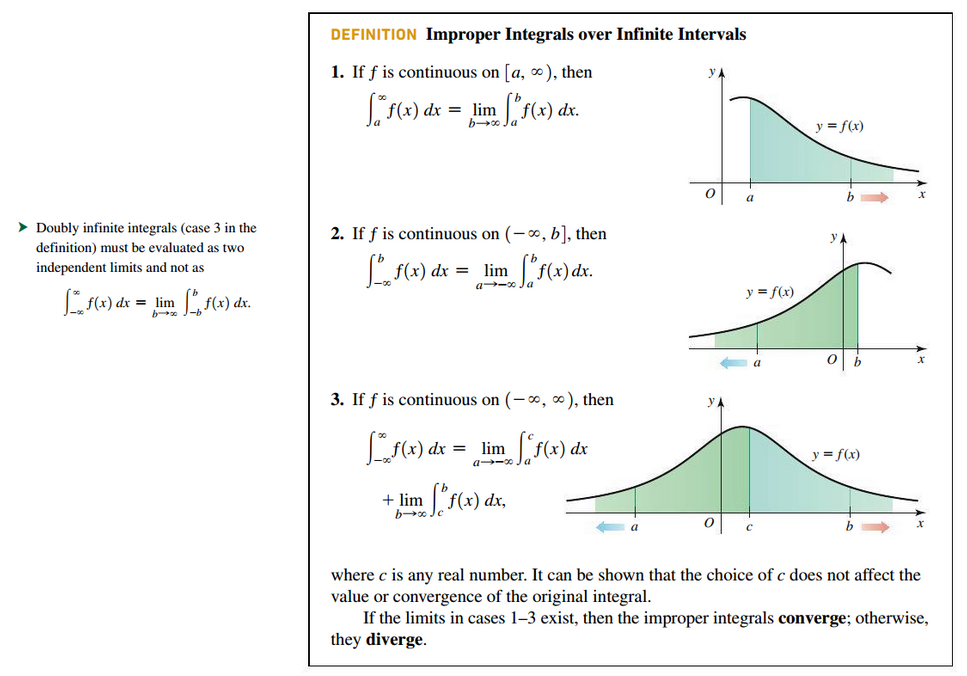

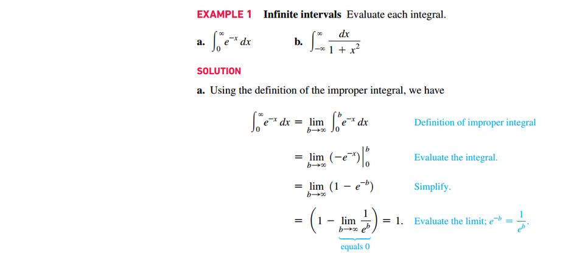
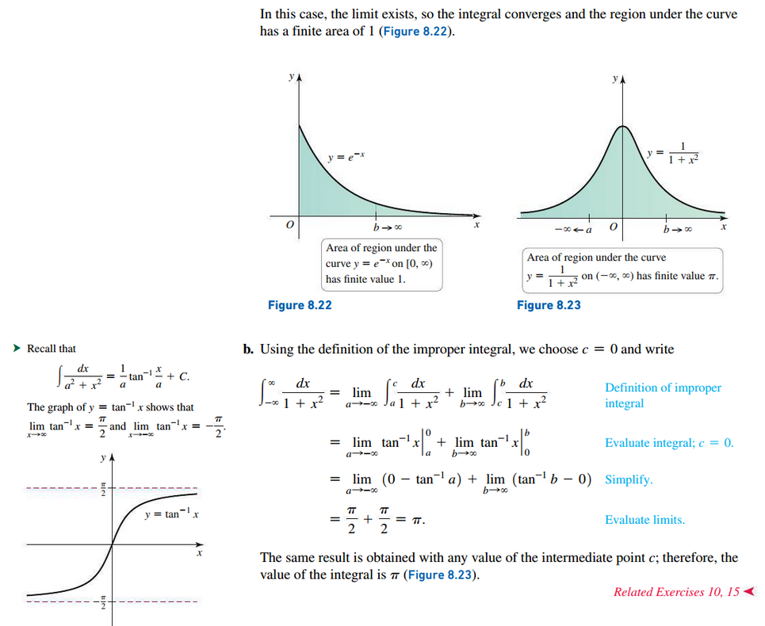
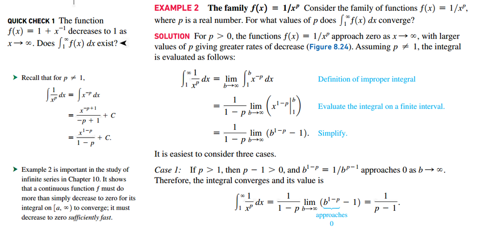
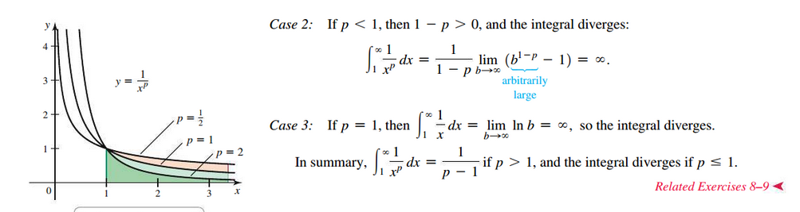
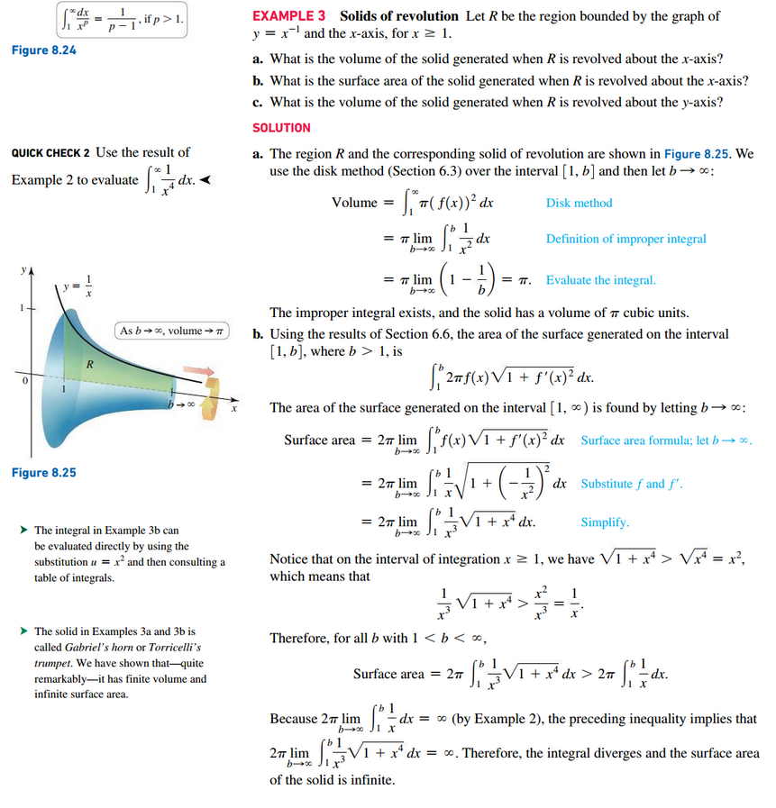
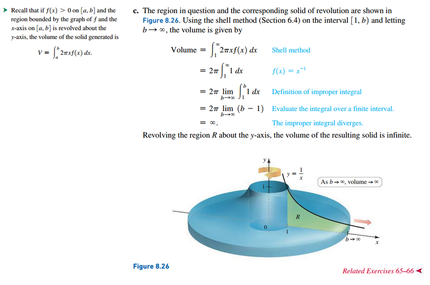

## Unbounded Integrands

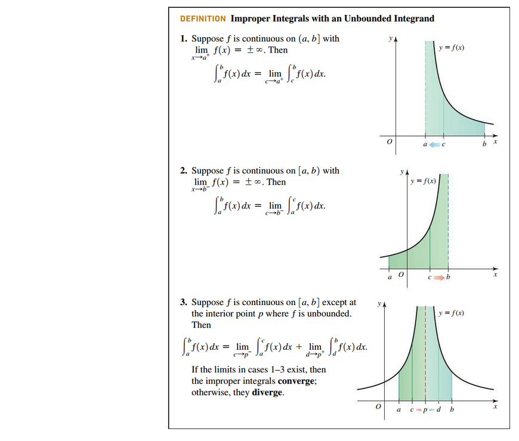

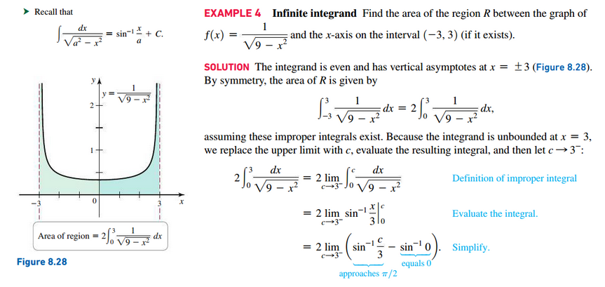
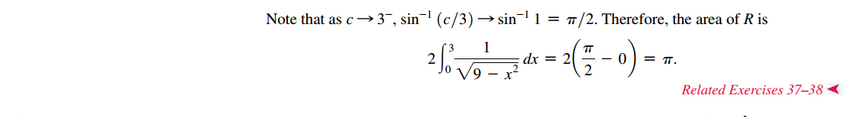
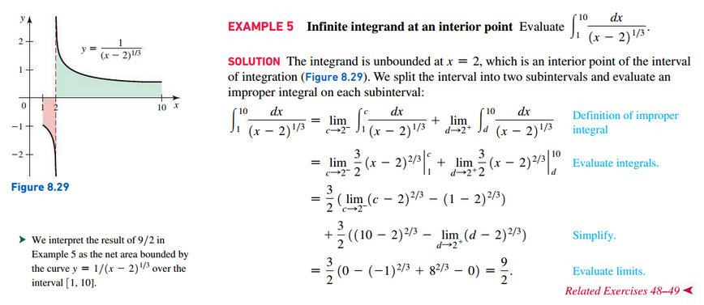
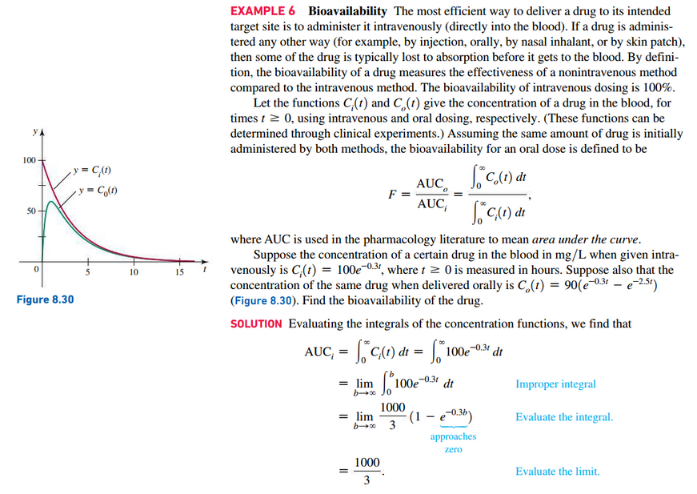
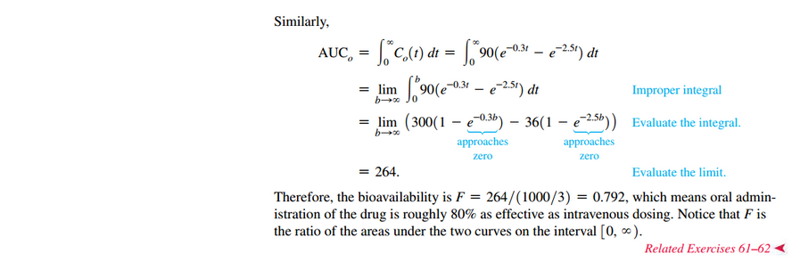

## Comparison Test

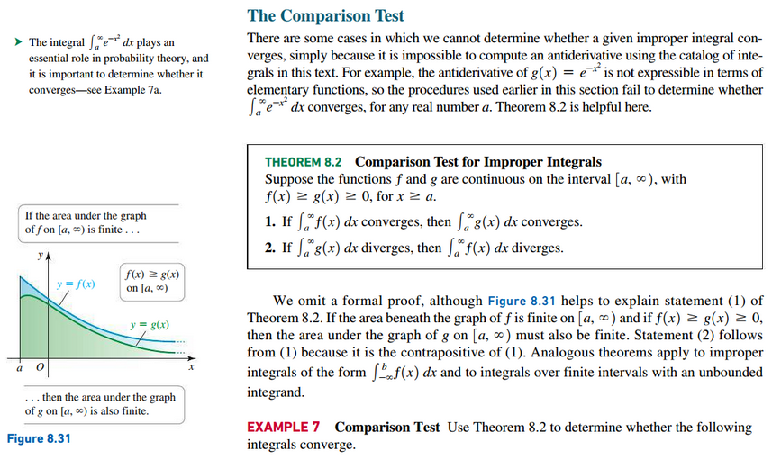

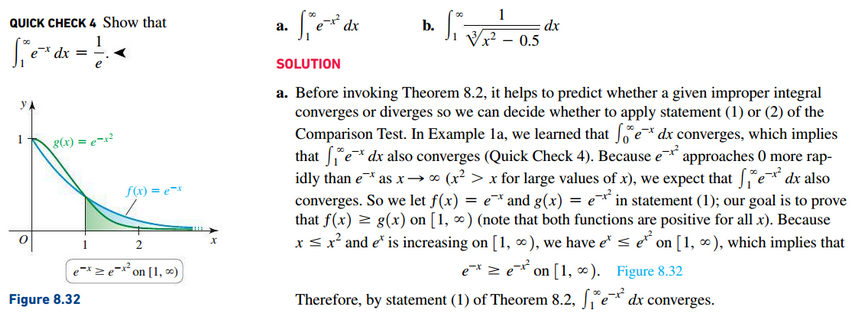
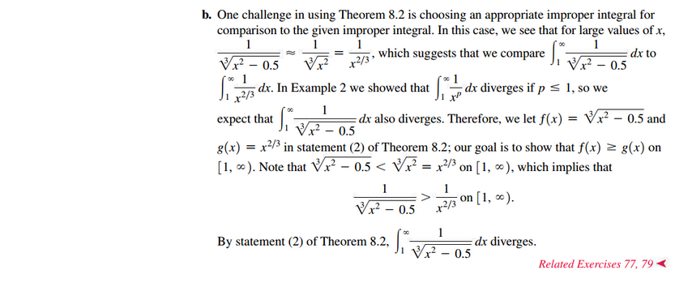

 

# Resources

Textbook

+ Calculus, Early Transcendentals 3rd Edition - Briggs, Cochran, and Gillet
