# Formulas

## Derivatives

### Product Rule

$$
\frac{d}{dx}[f(x)g(x)] = f(x)\frac{d}{dx}[g(x)] + g(x)\frac{d}{dx}[f(x)]
$$

### Quotient Rule

$$
\frac{d}{dx}\left [ \frac{f(x)}{g(x)} \right ] = \frac{g(x)\dfrac{d}{dx}[f(x)] - f(x)\dfrac{d}{dx}[g(x)]}{[g(x)]^{2}}
$$

### Chain Rule

$$
F^{\prime}(x) = f^{\prime}(g(x)) \cdot g^{\prime}(x)
$$

## Integration

### Length of a Curve

$$
L = \int_{a}^{b} \sqrt{1 + f^{\prime}(x)^{2}}\;dx
$$

### Area

$$
A = \int_{a}^{b} f(x)\;dx
$$

### Area Between Curves

$$
A = \int_{a}^{b} \left | f(x) - g(x) \right |\;dx
$$

### Area of a Surface of Revolution

$$
S = \int_{a}^{b} 2 \pi f(x)\sqrt{1 + f^{\prime}(x)^{2}}\;dx
$$

### Volume

#### Disk Method (about $x$-axis)

$$
V = \int_{a}^{b} \pi f(x)^{2}\;dx
$$

#### Shell Method (about $y$-axis)

$$
V = \int_{a}^{b} 2 \pi xf(x)\;dx \;\;\; \text{ where } 0 \le a \le b
$$

### Reduction Formulas

$$
\begin{array}{ll}
	{\displaystyle \int x^{n}e^{ax}dx} = \dfrac{x^{n}e^{ax}}{a} - \dfrac{n}{a}{\displaystyle \int x^{n - 1}e^{ax}dx} & \text{ for } a \neq 0 \\
	~\\
	{\displaystyle \int \ln^{n}(x)dx} = x\ln^{n}(x) - n {\displaystyle \int \ln^{n - 1}(x)dx} \\
\end{array}
$$

Assume $n$ is a positive integer.

$$
\begin{array}{ll}
	{\displaystyle \int x^{n}\cos(ax)dx} = \dfrac{x^{n}\sin(ax)}{a} - \dfrac{n}{a}{\displaystyle \int x^{n - 1}\sin(ax)d} & \text{ for } a \neq 0 \\
	~\\
	{\displaystyle \int x^{n}\sin(ax)dx} = -\dfrac{x^{n}\cos(ax)}{a} + \dfrac{n}{a}{\displaystyle \int x^{n - 1}\cos(ax)d} & \text{ for } a \neq 0 \\
	~\\
	{\displaystyle \int \tan^{n}(x)\;dx} = \frac{\tan^{n - 1}(x)}{n - 1} - {\displaystyle \int \tan^{n - 2}(x)\;dx} & \text{ for } n \neq 1 \\
	~\\
	{\displaystyle \int \sec^{n}(x)\;dx} = \frac{\sec^{n - 2}(x)\tan(x)}{n - 1} + \frac{n - 2}{n - 1}{\displaystyle \int \sec^{n - 2}(x)\;dx} & \text{ for } n \neq 1 \\
\end{array}
$$

### Integration by Parts Formula

Use the acronym "LIPET" to help choosing the value when substituting for $u$.

- **L**ogarithmic -- e.g. $\ln(x)$
- **I**nverse Trigonometric -- e.g. $\tan^{-1}(x)$
- **P**olynomial -- e.g. $x^{2}$
- **E**xponential -- e.g. $e^{x}$
- **T**rigonometric -- e.g. $\cos(x)$

to prioritize choosing $u$ in the order of **LIPET**, **L** being the first
priority and **T** being the last.

**Integration by Parts for Indefinite Integrals**

$$
\int u\;dv = uv - \int v\;du
$$

**Integration by Parts for Definite Integrals**

$$
\int_{a}^{b} u(x)v^{\prime} (dx)dx = \left . u(x)v(x) \right |_{a}^{b} - \int_{a}^{b} v(x)u^{\prime}(x)dx
$$

### Trigonometric Substitution

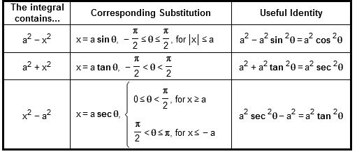

### Numerical Integration

#### Absolute and Relative Error

$$
\textbf{absolute error} = \left | c - x \right | \\
~\\
\textbf{relative error} = \frac{\left | c - x \right |}{\left [ x \right ]} \;\;\; (\text{if } x \neq 0).
$$

#### Midpoint Rule

$$
\begin{aligned}
 M(n) &= f(m_{1})\Delta{x} + f(m_{2})\Delta{x} + \cdots + f(m_{n})\Delta{x} \\
   &= \sum_{k = 1}^{n} f(\frac{x_{k - 1} + x_{k}}{2})\;\Delta{x} \\
\end{aligned}
$$

where

$$
\Delta{x} = \frac{b - a}{n}, \;\;\; x_{0} = a, \;\;\; x_{k} = a + k\Delta{x}, \;\;\; m_{k} = \frac{x_{k - 1} + x_{k}}{2}
$$

#### Trapezoid Rule

$$
T(n) = \left ( \frac{1}{2}f(x_{0}) + \sum_{k = 1}^{n - 1} f(x_{k}) + \frac{1}{2}f(x_{n}) \right )\Delta{x}
$$

where

$$
\Delta{x} = \frac{b - a}{n}, \;\;\; x_{k} = a + k\Delta{x}
$$

#### Simpson's Rule

$$
S(n) = \left ( f(x_{0}) + 4f(x_{1}) + 2f(x_{2}) + 4f(x_{3}) + \cdots + 2f(x_{n - 2}) + 4f(x_{n - 1}) + f(x_{n}) \right )\frac{\Delta{x}}{3}
$$

where

$$
\Delta{x} = \frac{b - a}{n}, \;\;\; x_{k} = a + k\Delta{x}
$$

## Partial Fraction Decomposition

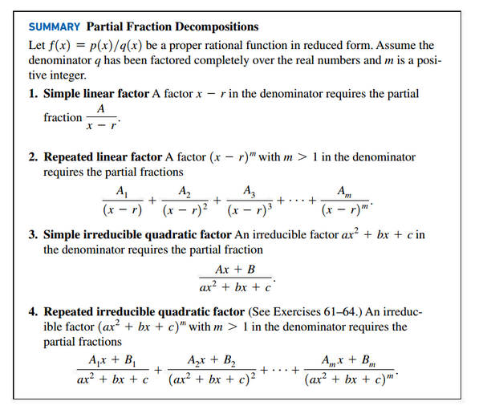

## Physical Applications

### Mass of a One-Dimensional Object

$$
m = \int_{a}^{b} \rho(x)\;dx
$$

### Work

$$
W = \int_{a}^{b} F(x)\;dx
$$

### Pumping Water

$$
W = \int_{a}^{b} \rho gA(y)D(y)\;dy
$$

### Force on a Dam

$$
F = \int_{0}^{a} \rho g(a - y)w(y)\;dy
$$

## Sequences and Infinite Series

### Terminology for Sequences

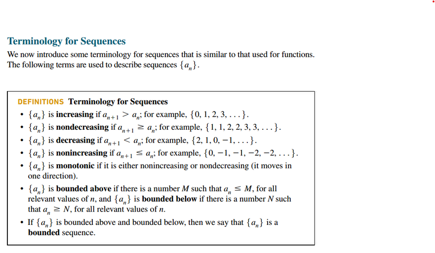

### Geometric Series

Sum of geometric series $\sum_{k = 0}^{n - 1} ar^{k}$

$$
S_{n} = \frac{a(1 - r^{n})}{1 - r}, r \neq 1
$$

Geometric sum with $n$ terms has the form
$S_{n} = a + ar + ar^{2} + \cdots ar^{n - 1} = \sum_{k = 0}^{n - 1} ar^{k}$,
where $a \neq 0$ and $r$ are real numbers, $r$ is called the ration of the sum
and $a$ is its first term

$$
S_{n} = \frac{a_{1}(r^{n} - 1)}{r - 1}
$$

#### The Limit of a Geometric series

The limiting behavior of a geometric series $\sum_{k = 0}^{\infty} ar^{k}$ is
governed by the value of $r$.

- if $|r| \ge 1$ then the series diverges
- if $|r| < 1$ then the series converges to $\frac{a}{1 -r}$.

for $|r| < 1$,

$$
\sum_{k = 0}^{\infty} ar^{k} = \frac{a}{1 - r}
$$

where $a$ as the first term in the sequence and not equals to $0$, and $r$ as
the common ration.

e.g.

$$
\sum_{m = 2}^{\infty} \frac{8}{9^{m}}
$$

$a = \dfrac{8}{9^{2}}$, $r = \dfrac{1}{9}$

### Telescoping Series

$$
\sum_{k = 1}^{\infty}(b_{k} - b_{k + 1}) = b_{1}
$$

where ${\displaystyle \lim_{n \to \infty} b_{n} = 0}$.

### Growth Rates of Sequences

$$
\left \{ \ln_{q}(n) \right \} << \left \{ n^{p} \right \} << \left \{ n^{p}\ln_{r}(n) \right \} << \left \{ n^{p + s} \right \} << \left \{ b^{n} \right \} << \left \{ n! \right \} << \left \{ n^{n} \right \}
$$

> The ordering applies for positive real numbers $p$, $q$, $r$, $s$, and $b > 1$

# Common Identities

## Polynomial

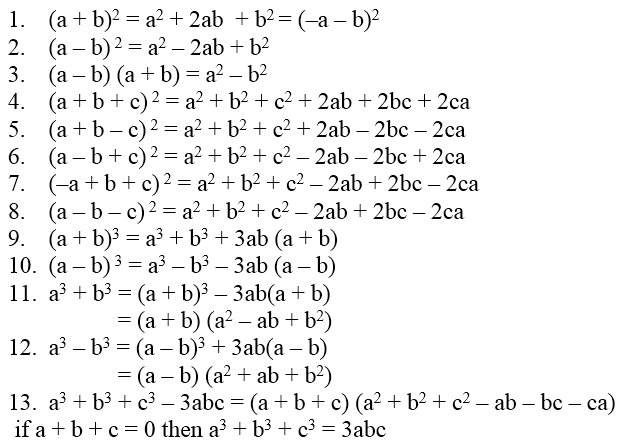

## Trigonometric

- [⬇ Famous Trig Identities](file:../../../../files/spring-2020/MATH-141/ch-6/ch-6_handout-24.pdf)
- [⬇ Trig Cheatsheet](file:../../../../files/winter-2021/MATH-151/notes/trig_cheatsheet.pdf)

$\theta = (cos(x), sin(x))$

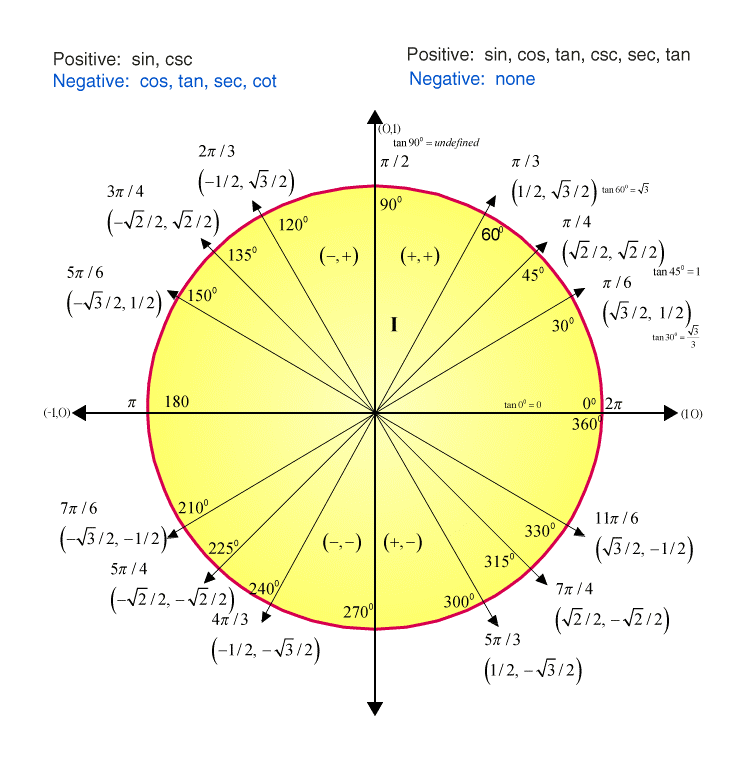
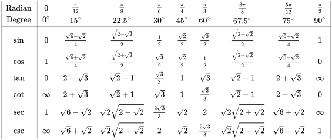
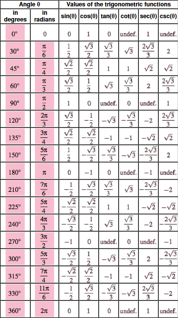

## Logarithmic Identities

$$
\begin{array}{ll}
	\ln(1) &=& 0 \\
	~\\
	\ln(e) &=& 1 \\
	~\\
	\ln(x) &=& \log_{e}(x) \\
	~\\
	\log(x) &=& \log_{10}(x) \\
	~\\
	\log_{b}(1) &=& 0 \\
	~\\
	\log_{b}(b) &=& 1 \\
	~\\
	\log_{b}(x^{e}) &=& e\log_{b}(x) \\
	~\\
	\log_{b}(xy) &=& \log_{b}(x) + \log_{b}(y)  \\
	~\\
	\log_{b}(x) &=& \dfrac{1}{\log_{x}(b)} \\
	~\\
	x^{\log_{b}(y)} &=& y^{\log_{b}(x)} \\
	~\\
	\log_{b}(0) &=& \text{undefined} \\
	~\\
	\log_{b}(-x) &=& \text{undefined} \\
	~\\
	\log_{b}(x) &=& \dfrac{\ln(x)}{\ln(b)}
\end{array}
$$

# Common Rules

## Product Rules

$$
\begin{array}{ll}
	a^{x} \cdot a^{y} = a^{x + y} & a^{x} \cdot b^{x} = (a \cdot b)^{x} \\
\end{array}
$$

## Quotient Rules

$$
\begin{array}{ll}
	\dfrac{a^{x}}{a^{y}} = a^{x - y} & \dfrac{a^{x}}{a^{x}} = \left ( \dfrac{a}{b} \right )^{x} \\
\end{array}
$$

## Exponent Rules

$$
\begin{array}{ll}
	\left ( b^{x} \right )^{y} = b^{x \cdot y} & b^{x^{y}} = b^{(3^{2})} &  \\
	~\\
	\sqrt[y]{b^{x}} = b^{\frac{x}{y}} & b^{\frac{1}{x}} = \sqrt[x]{b} \\
	~\\
	b^{x} = e^{\ln(b^{x})} & b^{-x} = \dfrac{1}{b^{x}} \\
\end{array}
$$

## Logarithm Rules

$$
\begin{array}{ll}
	\ln(x) = \log_{e}(x) \\
	~\\
	\log_{b}(x \cdot y) = \log_{b}(x) + \log_{b}(y) & \log_{b}(\frac{x}{y}) = \log_{b}(x) - \log_{b}(y) \\
	~\\
	\log_{b}(x^{y}) = y \cdot \log_{b}(x) & \ln(x^{y}) = y\ln(x) \\
	~\\
	\log_{b}(c) = \dfrac{1}{\log_{c}(b)} & \log_{b}(\sqrt[y]{x}) = \dfrac{\log_{b}(x)}{y} \\
	~\\
	c\log_{b}(x) + d\log_{b}(y) = \log_{b}(x^{c}y^{d}) \\
	~\\
	\log_{b}(1) = 0 & \log_{b}(b) = 1 \\
	~\\
	\lim_{x \to 0^{+}} \log_{b}(x) = -\infty & \lim_{x \to \infty} \log_{b}(x) = \infty \\
	~\\
	\log_{b}(x) \text{ is undefined when } x \le 0 \\
	~\\
	\dfrac{d}{dx}\left [ \log_{b}(x) \right ] = \dfrac{1}{x\ln(b)}& {\displaystyle \int \log_{b}(x)\;dx} = x\log_{b}(x) - \dfrac{x}{\ln(b)} + C \\
\end{array}
$$

## Zero Rules

$$
\begin{array}{ll}
	b^{0} = 1 & 0^{x} = 0, \text{ for } n > 0 \\
\end{array}
$$

## Derivative Rule

$$
\frac{d}{dx}(x^{n}) = n \cdot x^{n - 1}
$$

## Integral Rule

$$
\int x^{n}\;dx = \frac{x^{n + 1}}{n + 1} + C
$$

## Limit Laws

$$
\underline{\textbf{Sum Law}} \\
~\\
1.\; \lim_{x \to a} [f(x) + g(x)] = \lim_{x \to a} f(x) + \lim_{x \to a} g(x) \\
~\\
\underline{\textbf{Difference Law}} \\
~\\
2.\; \lim_{x \to a} [f(x) - g(x)] = \lim_{x \to a} f(x) - \lim_{x \to a} g(x) \\
~\\
\underline{\textbf{Constant Multiple Law}} \\
~\\
3.\; \lim_{x \to a} [cf(x)] = c \lim_{x \to a} f(x) \\
~\\
\underline{\textbf{Product Law}} \\
~\\
4.\; \lim_{x \to a} [f(x)g(x)] = \lim_{x \to a} f(x) \cdot \lim_{x \to a} g(x) \\
~\\
\underline{\textbf{Quotient Law}} \\
~\\
5.\; \lim_{x \to a} \frac{f(x)}{g(x)} = \frac{\lim_{x \to a} f(x)}{\lim_{x \to a} g(x)} \text{ if } \lim_{x \to a} g(x) \neq 0 \\
~\\
\underline{\textbf{Power Law}} \\
~\\
6.\; \lim_{x \to a} [f(x)]^{n} = [\lim_{x \to a} f(x)]^{n} \; \text{ where } n \text{ is a positive integer } \\
~\\
7.\; \lim_{x \to a} c = c \\
~\\
8.\; \lim_{x \to a} x = a \\
~\\
9.\; \lim_{x \to a} x^{n} = a^{n} \; \text{ where } n \text{ is a positive integer } \\
~\\
10.\; \lim_{x \to a} \sqrt[n]{x} = \sqrt[n]{a} \; \text{ where } n \text{ is a positive integer }
~\\
\underline{\textbf{Root Law}} \\
~\\
11.\; \lim_{x \to a} \sqrt[n]{f(x)} = \sqrt[n]{\lim_{x \to a} f(x)} \; \text{ where } n \text{ is a positive integer } \\
~\\
[\text{ if  } n \text{ is even, we assume that } \lim_{x \to a} f(x) > 0 \text{. }]
$$

### Limit Chain Rule

First take the limit of $g(x)$, then substitute the limit of $g(x)$ for $u$ into
the original limit and update the limit bounds with $u$.

$$
\lim_{x \to a} f(g(x)) = L
$$

$$
\begin{array}{ll}
	\lim_{x \to a} g(x) = b & \lim_{u \to b} f(u) = L \\
\end{array}
$$

# Derivatives

## Polynomial

$$
\begin{array}{ll}
	\dfrac{d}{dx}(x) &=& 1 \\
	~\\
	\dfrac{d}{dx}(x^{2}) &=& 2x \\
	~\\
	\dfrac{d}{dx}(x^{n}) &=& nx^{n - 1} \\
	~\\
	\dfrac{d}{dx}(x^{\frac{1}{n}}) &=& \dfrac{1}{nx^{\frac{1}{n} - 1}} \\
	~\\
	\dfrac{d}{dx}(mx^{n}) &=& mnx^{n - 1} \\
\end{array}
$$

## Trigonometric Functions

$$
\begin{array}{ll}
	\dfrac{d}{dx}(\sin{x}) = \cos{x} & \dfrac{d}{dx}(\csc{x}) = -\csc{x}\cot{x} \\
	~\\
	\dfrac{d}{dx}(\cos{x}) = -\sin{x} & \dfrac{d}{dx}(\sec{x}) = \sec{x}\tan{x} \\
	~\\
	\dfrac{d}{dx}(\tan{x}) = \sec^{2}{x} & \dfrac{d}{dx}(\cot{x}) = -\csc^{2}{x} \\
\end{array}
$$

## Hyperbolic Functions

$$
\begin{array}{ll}
	\dfrac{d}{dx}(\sinh{x}) = \cosh{x} & \dfrac{d}{dx}(\operatorname{csch}{x}) = -\operatorname{csch}{x}\coth{x} \\
	~\\
	\dfrac{d}{dx}(\cosh{x}) = \sinh{x} & \dfrac{d}{dx}(\operatorname{sech}{x}) = -\operatorname{sech}{x}\tanh{x} \\
	~\\
	\dfrac{d}{dx}(\tanh{x}) = \operatorname{sech}^{2}{x} & \dfrac{d}{dx}(\coth{x}) = -\operatorname{csch}^{2}{x} \\
	~\\
	\dfrac{d}{dx}(\sinh{ax}) = a\cosh{ax} & \dfrac{d}{dx}(\operatorname{csch}ax) = -a\operatorname{csch}{ax}\coth{ax} \\
	~\\
	\dfrac{d}{dx}(\cosh{ax}) = a\sinh{ax} & \dfrac{d}{dx}(\operatorname{sech}ax) = -a\operatorname{sech}{ax}\tanh{ax} \\
	~\\
	\dfrac{d}{dx}(\tanh{ax}) = a\operatorname{sech}^{2}ax & \dfrac{d}{dx}(\coth{ax}) = -a\operatorname{csch}^{2}{ax} \\
\end{array}
$$

## Inverse Trigonometric Functions

$$
\begin{array}{ll}
	\dfrac{d}{dx}(\sin^{-1}{x}) = \dfrac{1}{\sqrt{1 - x^{2}}} & \dfrac{d}{dx}(\csc^{-1}{x}) = -\dfrac{1}{x\sqrt{x^{2} - 1}} \\
	~\\
	\dfrac{d}{dx}(\cos^{-1}{x}) = -\dfrac{1}{\sqrt{1 - x^{2}}} & \dfrac{d}{dx}(\sec^{-1}{x}) = \dfrac{1}{x\sqrt{x^{2} - 1}} \\
	~\\
	\dfrac{d}{dx}(\tan^{-1}{x}) = \dfrac{1}{1 + x^{2}} & \dfrac{d}{dx}(\cot^{-1}{x}) = -\dfrac{1}{1 + x^{2}}
\end{array}
$$

## Inverse Hyperbolic Functions

$$
\begin{array}{ll}
	\dfrac{d}{dx}(\sinh^{-1}{x}) = \dfrac{1}{\sqrt{1 + x^{2}}} & \dfrac{d}{dx}(\operatorname{csch}^{-1}{x}) = -\dfrac{1}{\left | x \right |\sqrt{x^{2} + 1}} \\
	~\\
	\dfrac{d}{dx}(\cosh^{-1}{x}) = \dfrac{1}{\sqrt{x^{2} - 1}} & \dfrac{d}{dx}(\operatorname{sech}^{-1}{x}) = -\dfrac{1}{x\sqrt{1 - x^{2}}} \\
	~\\
	\dfrac{d}{dx}(\tanh^{-1}{x}) = \dfrac{1}{1 - x^{2}} & \dfrac{d}{dx}(\coth^{-1}{x}) = \dfrac{1}{1 - x^{2}}
\end{array}
$$

## Logarithmic

$$
\begin{array}{ll}
	\dfrac{d}{dx}(\ln(x)) &=& \dfrac{1}{x} \\
	~\\
	\dfrac{d}{dx}(\ln(mx)) &=& \dfrac{1}{x} \\
	~\\
	\dfrac{d}{dx}(\ln(x^{n})) &=& \dfrac{n}{x} \\
	~\\
	\dfrac{d}{dx}(\ln(mx^{n})) &=& \dfrac{n}{x} \\
	~\\
	\dfrac{d}{dx}(\log_{b}(x)) &=& \dfrac{1}{x\ln(b)} \\
	~\\
	\dfrac{d}{dx}(\log_{b}(mx)) &=& \dfrac{1}{x\ln(b)} \\
	~\\
	\dfrac{d}{dx}(\log_{b}(x^{n})) &=& \dfrac{n}{x\ln(b)} \\
	~\\
	\dfrac{d}{dx}(\log_{b}(mx^{n})) &=& \dfrac{n}{x\ln(b)} \\
\end{array}
$$

## Exponential

$$
\begin{array}{ll}
	\dfrac{d}{dx}(a^{x}) &=& \dfrac{d}{dx}\left [ (e^{\ln(a)})^{x} \right ] &=& a^{x}\ln(a) \\
	~\\
	\dfrac{d}{dx}(a^{nx}) &=& \dfrac{d}{dx}\left [ (e^{\ln(a)})^{nx} \right ] &=& na^{nx}\ln(a) \\
	~\\
	\dfrac{d}{dx}(e^{x}) &=& e^{x} \\
	~\\
	\dfrac{d}{dx}(e^{nx}) &=& ne^{nx} \\
\end{array}
$$

# Antiderivatives (Integral)

## Table of Integrals

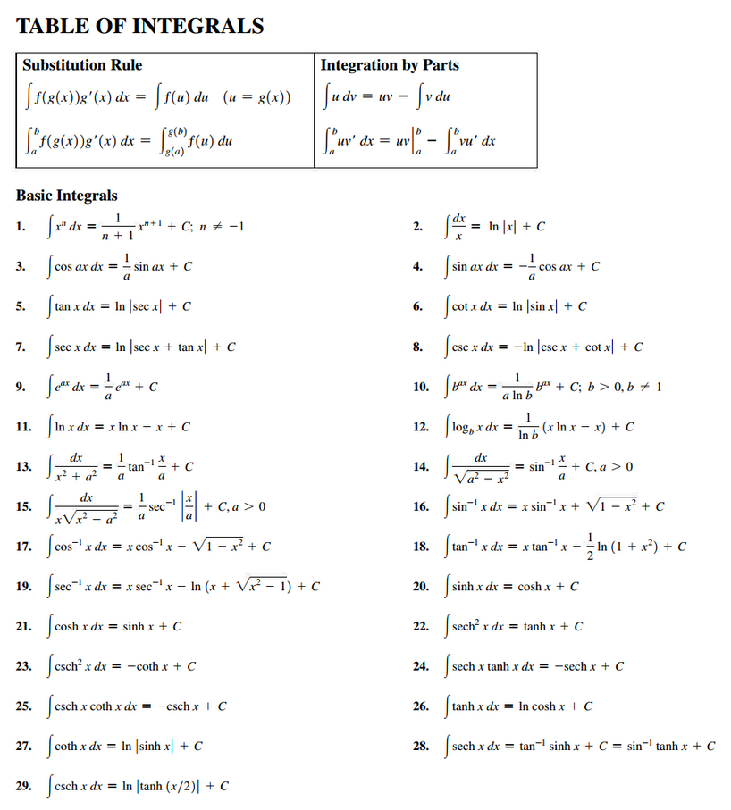
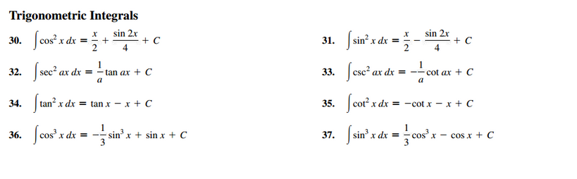
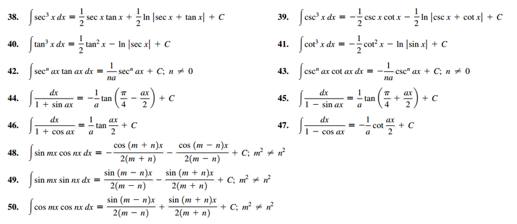
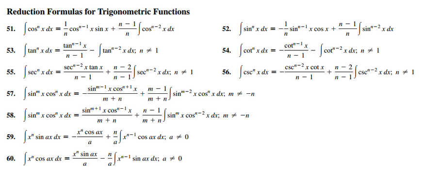
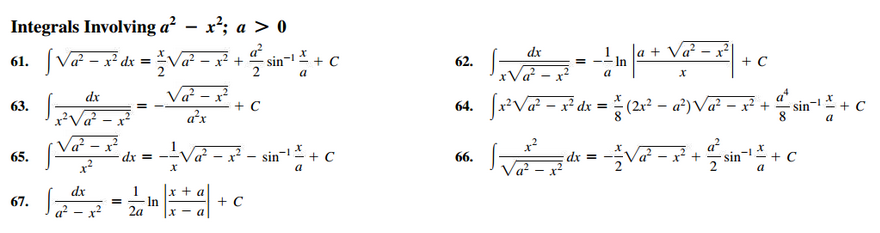
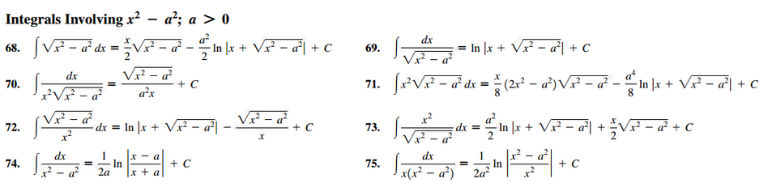
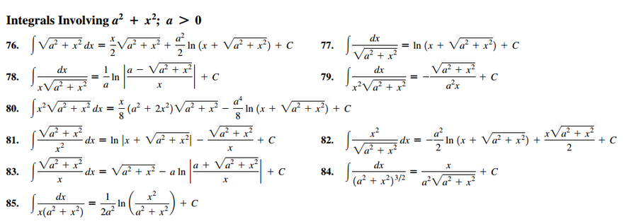
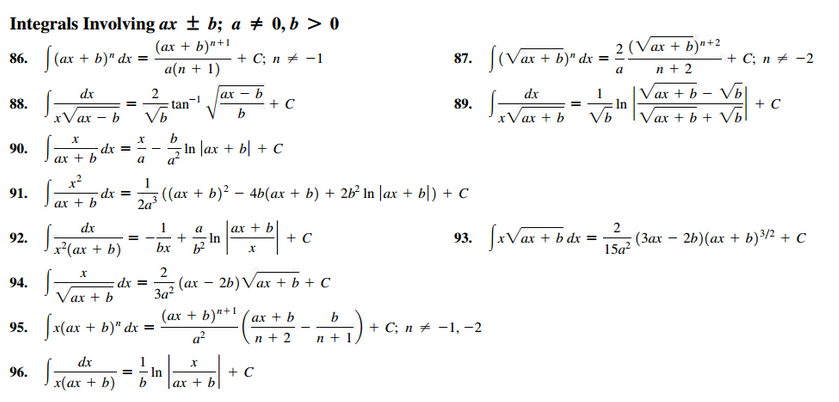
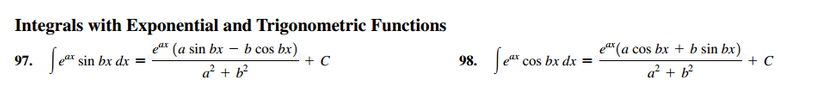
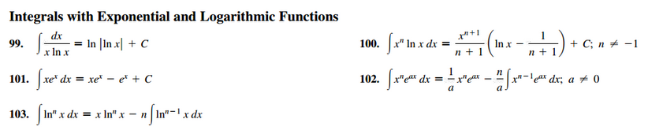
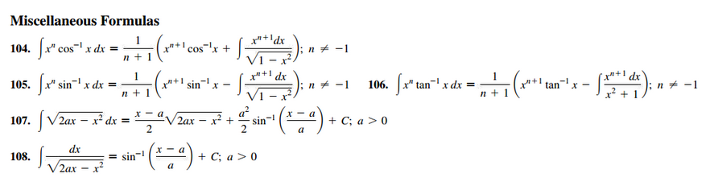

## Common Integration Formulas

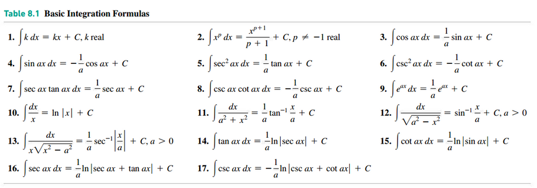

## Common Indefinite Integrals

$$
\begin{array}{ll}
  \int cf(x)dx = c \int f(x)dx & \int [f(x) + g(x)]dx = \int f(x)dx + \int g(x)dx \\
	~\\
  \int k\;dx = kx + C \\
	~\\
  \int x^{n}dx = \dfrac{x^{n + 1}}{n + 1} + C(n \neq - 1) & \int \dfrac{1}{x}dx = \ln |x| + C\\
	~\\
  \int e^{x}dx = e^{x} + C & \int b^{x}dx = \dfrac{b^{x}}{\ln(b)} + C \\
	~\\
  \int \sin(x)\;dx = -\cos(x) + C & \int \cos(x)dx = \sin(x) + C \\
	~\\
  \int \sin^{2}(x)\;dx = \frac{1}{2} \left ( x - \frac{1}{2}\sin(2x) \right ) + C & \int \cos^{2}(x)dx = \frac{1}{2} \left ( x + \frac{1}{2}\sin(2x) \right ) + C \\
	~\\
  \int \sec^{2}(x)dx = \tan(x) + C & \int \csc^{2}(x)dx = -\cot(x) + C \\
	~\\
  \int \sec(x)\tan(x)dx = \sec(x) + C & \int \csc(x)\cot(x)dx = - \csc(x) + C \\
	~\\
  \int \dfrac{1}{x^{2} + 1}dx = \tan^{-1}(x) + C & \int \dfrac{1}{\sqrt{1 - x^{2}}}dx = \sin^{-1}(x) + C \\
	~\\
  \int \sinh(x)dx = \cosh(x) + C & \int \cosh(x)dx = \sinh(x) + C
\end{array}
$$

## Polynomial

$$
\begin{array}{ll}
	\int x\;dx &=& \dfrac{x^{2}}{2} + C \\
	~\\
	\int x^{n}\;dx &=& \dfrac{x^{n + 1}}{n + 1} + C \\
	~\\
	\int \sqrt[y]{x}\;dx &=& \dfrac{x^{\frac{1}{y} + 1}}{\frac{1}{y} + 1} + C \\
	~\\
	\int x^{\frac{m}{n}}\;dx &=& \dfrac{x^{\frac{m}{n} + 1}}{\frac{m}{n} + 1} + C = \dfrac{nx\frac{m + n}{n}}{m + n} + C \\
	~\\
	\int mx^{n}\;dx &=& m\dfrac{x^{n + 1}}{n + 1} + C \\
	~\\
	\int \frac{1}{x}\;dx &=& \ln|x| + C \\
\end{array}
$$

## Trigonometric Functions

$$
\begin{array}{lll}
	{\displaystyle \int \sin(x)} = -\cos(x) + C & {\displaystyle \int \cos(x)} = \sin(x) + C \\
	~\\
	{\displaystyle \int \sin(mx)} = -\dfrac{1}{m}\cos(mx) + C & {\displaystyle \int \cos(mx)} = \dfrac{1}{m}\sin(mx) + C \\
	~\\
	{\displaystyle \int \csc(x)} = -\ln \left | \csc(x) + \cot(x) \right | + C & {\displaystyle \int sec(x)} = \ln \left | \tan(x) + \sec(x) \right | + C \\
	~\\
	{\displaystyle \int \csc(x)} = \ln \left | \tan(\frac{x}{2}) \right | + C \\
	~\\
	{\displaystyle \int \csc(mx)} = -\frac{1}{m}\ln \left | \csc(mx) + \cot(mx) \right | + C & {\displaystyle \int sec(mx)} = \frac{1}{m}\ln \left | \tan(mx) +\sec(mx) \right | + C \\
	~\\
	{\displaystyle \int \csc(mx)} = \frac{1}{m}\ln \left | \tan(\frac{mx}{2}) \right | + C \\
	~\\
	{\displaystyle \int \tan(x)} = -\ln \left | \cos(x) \right | + C & {\displaystyle \int cot(x)} = \ln \left | \sin(x) \right | + C \\
	~\\
	{\displaystyle \int \tan(mx)} = -\frac{1}{m}\ln \left | \cos(mx) \right | + C & {\displaystyle \int cot(mx)} = \frac{1}{m}\ln \left | \sin(mx) \right | + C \\
\end{array}
$$

## Logarithmic

$$
\begin{array}{ll}
	\int \ln(x)\;dx &=& x\ln(x) - x + C \\
	~\\
	\int \ln(x^{n})\;dx &=& nx\ln(nx) - nx + C \\
	~\\
	\int \ln(mx)\;dx &=& x\ln(mx) - x + C \\
	~\\
	\int \ln(mx^{n})\;dx &=& x\ln(m) + nx\ln(x) - nx + C \\
	~\\
	\int \log_{b}(x)\;dx &=& {\displaystyle \int \frac{\ln(x)}{ln(b)}} = x\log_{b}(x) - \dfrac{x}{\ln(b)} + C \\
	~\\
	\int \log_{b}(x^{n})\;dx &=& n\left ( x\log_{b}(x) - \dfrac{x}{\ln(b)} \right ) + C \\
	~\\
	\int \log_{b}(mx)\;dx &=& x\log_{b}(mx) - \dfrac{x}{\ln(b)} + C \\
	~\\
	\int \log_{b}(mx^{n})\;dx &=& x\log_{b}(m) + n\left ( x\log_{b}(x) - \dfrac{x}{\ln(b)} \right ) + C \\
\end{array}
$$

## Exponential

$$
\begin{array}{ll}
	\int a^{x}\;dx = \dfrac{a^{x}}{\ln(a)} + C \\
	~\\
	\int a^{nx}\;dx = \dfrac{a^{nx}}{n\ln(a)} + C \\
	~\\
	\int \dfrac{1}{a^{x}}\;dx = \dfrac{a^{-x}}{\ln(a)} + C \\
	~\\
	\int \dfrac{1}{a^{nx}}\;dx = \dfrac{a^{-nx}}{n\ln(a)} + C \\
	~\\
	\int e^{x}\;dx = e^{x} + C \\
	~\\
	\int e^{mx}\;dx = \dfrac{1}{m}e^{mx} + C \\
\end{array}
$$

